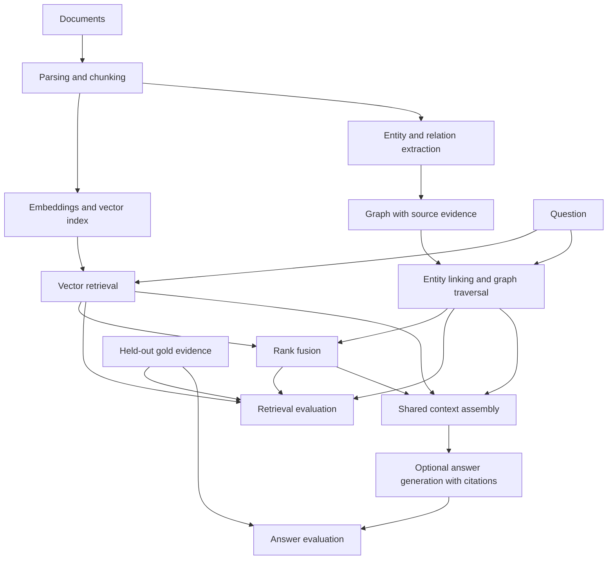

# GraphRAG Bench

When does graph-based retrieval outperform vector retrieval for questions requiring evidence across documents?

GraphRAG Bench is a small research-engineering project for comparing vector, graph, and hybrid retrieval under the same evidence budget. Retrieval quality will be measured independently of answer generation.

**Current milestone: M11 — comparison runner implemented; full study incomplete.** The runner compares verified, frozen paper chunks, vector indexes, and optional complete LLM graphs under one evidence budget. The corpus contains 30 papers, 558 pages, 6,996 chunks, and 40 draft dev questions. Full graph extraction, the four-method real-paper comparison, independent annotation review, and 80 genuinely held-out questions remain. No general retrieval advantage has been established. Start with the [M11 lesson](docs/paper-comparison.md) and [development observations](reports/m11-development.md).

Latest local trial (0.11.1): source sentence filtering reduces planned model calls
to 1,416/6,996 chunks, but eight sampled calls produced **zero accepted relations**.
It remains experimental; the [trial report](reports/m11-development.md#cue-filter-trial-0111)
documents the failed quality check and replay safeguards.

## Quick start

Python 3.11 or newer is required. From this repository:

```bash
python3 -m venv .venv
.venv/bin/python -m pip install -r requirements-dev.txt
.venv/bin/python -m pip install --no-build-isolation -e .
.venv/bin/graphrag-bench validate-fixtures datasets/fixtures/tiny
```

Expected output:

```json
{"chunks": 25, "documents": 8, "entities": 15, "questions": 20, "relations": 23, "status": "valid"}
```

Installation downloads Python dependencies. Validation and unit tests run offline without model downloads, API keys, or provider calls. Core dependency versions are pinned in `requirements-dev.txt`; supported dependency ranges live in `pyproject.toml`. Real neural retrieval uses the separate optional setup below.

## Ingest documents

```bash
.venv/bin/graphrag-bench ingest datasets/examples/ingestion \
  --config configs/ingestion.toml \
  --output datasets/processed/m2-example
```

The example produces **2 documents and 4 chunks**, plus a manifest with source hashes, configuration, and implementation versions. Choose a fresh output directory for every run; existing directories are never overwritten. This command supports local `.txt`, `.md`, and `.markdown` files encoded as UTF-8. Pinned PDF corpora use the separate M10 `prepare-papers` command below.

For a concrete explanation of offsets and overlap:

```bash
.venv/bin/python scripts/study_m2.py
```

Start with the [study guide](docs/study-guide.md), then read the [M2 implementation walkthrough](docs/ingestion.md). It includes the algorithm, exact examples, parameter tradeoffs, provenance rules, test map, and limitations.

## Build and inspect a graph

After the ingestion command above:

```bash
.venv/bin/graphrag-bench build-graph datasets/processed/m2-example \
  --rules configs/extraction.toml \
  --output datasets/processed/m3-example
.venv/bin/python scripts/study_m3.py
```

The two-file example produces **7 entities, 6 assertion edges, and 0 issues**. The study script uses all eight fixture **source documents**, generates its own chunks, and produces **15 entities, 23 assertion edges, and 2 unsupported numeric statements**. Neither path reads gold annotations for extraction. Graph outputs are `graph.json`, `issues.jsonl`, and `manifest.json`; choose a fresh output directory on repeat runs.

Read the [M3 study walkthrough](docs/extraction-and-graph.md) for a beginner explanation, an evidence-backed two-link example, the exact algorithm, configuration, tests, and limitations. The default grammar expects one statement per line; it is not a general research-paper extractor.

## Retrieve source evidence

For the tested Linux x86_64 / Python 3.12 CPU setup:

```bash
.venv/bin/python -m pip install -r requirements-embeddings-cpu.txt
.venv/bin/graphrag-bench index-vector datasets/processed/m2-example \
  --config configs/embedding.toml --allow-download \
  --output datasets/processed/m4-example
.venv/bin/graphrag-bench query-vector datasets/processed/m4-example \
  --source datasets/processed/m2-example \
  --query "Which model does Alder build on?" --top-k 3
```

The first model setup downloads roughly 91 MB of weights plus the optional CPU libraries. Later commands use the cached pinned revision and local inference; omit `--allow-download` when cached. The two-file example produces a **4 × 384** matrix. Query output includes ranked chunk IDs, scores, original text, and source coordinates. Repeated runs need fresh output directories.

For a lexical comparison or a study session without model setup:

```bash
.venv/bin/graphrag-bench query-bm25 datasets/processed/m2-example \
  --query "Which model does Alder build on?" --top-k 3
.venv/bin/python scripts/study_m4.py
# After model setup, add --semantic for the real 25-chunk neural demonstration.
.venv/bin/python scripts/study_m4.py --semantic
```

Start with the [M4 vector-retrieval walkthrough](docs/vector-retrieval.md). It explains embeddings, cosine similarity, saved indexes, source evidence, the observed retrieval misses, and what remains unmeasured. The synthetic fixture demonstrates mechanics; it does not establish retrieval superiority.

## Retrieve through graph relationships

Using the existing ingestion and graph directories from above:

```bash
.venv/bin/graphrag-bench query-graph datasets/processed/m3-example \
  --source datasets/processed/m2-example \
  --config configs/graph-retrieval.toml \
  --query "Which dataset evaluates the model that Alder is based on?" --top-k 5
.venv/bin/python scripts/study_m5.py
```

Graph retrieval needs no neural model. The output includes ranked source chunks, query-link candidates, paths, ranking details, and any traversal caps reached. The [M5 graph-retrieval walkthrough](docs/graph-retrieval.md) explains hops, direction, ambiguity, mention evidence, and why reaching a useful source does not guarantee it appears in the top K.

## Combine vector and graph rankings

After the M4 index and M3 graph are available:

```bash
.venv/bin/graphrag-bench query-hybrid datasets/processed/m4-example \
  --graph datasets/processed/m3-example --source datasets/processed/m2-example \
  --config configs/hybrid-retrieval.toml --graph-config configs/graph-retrieval.toml \
  --query "Which dataset evaluates the model that Alder is based on?" --top-k 5
.venv/bin/python scripts/study_m6.py
# Optional real-model demonstration; uses the cached M4 model by default.
.venv/bin/python scripts/study_m6.py --semantic
```

The default takes up to 20 candidates from each method, combines rank positions using `1 / (60 + rank)`, and selects the final top K. Missing candidates contribute zero; shared chunk IDs occur only once. Both artifacts must belong to the same ingestion output. Hybrid retrieval does not require a new index or additional model weights.

Read the [M6 hybrid-retrieval walkthrough](docs/hybrid-retrieval.md) for plain-English explanations, worked arithmetic, configuration, reproducible examples, tests, and exercises. The default full-fixture demonstration still misses one required source in the Alder question's top five. Fusion is implemented; its benefit remains a research question.

## Measure retrieval evidence

After the M4 local model setup:

```bash
.venv/bin/graphrag-bench benchmark datasets/fixtures/tiny/corpus/documents.jsonl \
  --questions datasets/fixtures/tiny/gold/questions.jsonl --split fixture \
  --config configs/benchmark.toml --rules configs/extraction.toml \
  --embedding-config configs/embedding.toml --output experiments/runs/m7-fixture-example
.venv/bin/graphrag-bench verify-benchmark experiments/runs/m7-fixture-example
.venv/bin/python scripts/study_m7.py
```

The full run builds its own chunks, graph, and vector index from source documents; only the evaluator receives gold annotations. It runs 20 questions through four methods three times, producing 240 timed records. K=5 and K=10 share a 2,000-token context limit and the same pinned tokenizer. Choose a fresh output directory. `verify-benchmark` and the teaching script work without a neural model.

The first fixture run found complete evidence for **15/20 questions with vector, hybrid, and BM25 at K=5**, versus **11/20 with graph**. These familiar fictional questions are development diagnostics, not held-out research results. Read the [M7 study guide](docs/benchmark.md) for exact metric definitions and exercises, and the [fixture observation report](reports/m7-fixture.md) for paired successes, failures, and reproducibility details.

## Propose a graph with a local language model

After the optional CPU dependency setup, use the pinned M8 model from the local cache:

```bash
.venv/bin/graphrag-bench ingest datasets/examples/llm-extraction/texts \
  --config configs/sentence-fixture.toml --output datasets/processed/m8-example
.venv/bin/graphrag-bench build-llm-graph datasets/processed/m8-example \
  --config configs/llm-extraction.toml --output experiments/runs/m8-example \
  --response-cache experiments/runs/m8-example-cache
.venv/bin/graphrag-bench replay-llm-graph experiments/runs/m8-example \
  --source datasets/processed/m8-example --output experiments/runs/m8-example-replay
.venv/bin/python scripts/study_m8.py
```

The first model download requires an explicit `--allow-download` on `build-llm-graph`; the model is about 1 GB. No hosted inference API is used. Replay and the lesson run without neural dependencies. Inspect `issues.jsonl` and the raw responses before trusting the extracted relationships. Read the [M8 walkthrough](docs/llm-extraction.md) and [local observation report](reports/m8-local.md).

## Generate and inspect an answer proposal

Using the M8 example artifacts above and the same cached local model:

```bash
.venv/bin/graphrag-bench answer datasets/processed/m8-example \
  --graph experiments/runs/m8-example --config configs/generation.toml \
  --query "Which dataset evaluates the model used by Orion?" \
  --output experiments/runs/m9-example
cat experiments/runs/m9-example/answer.md
.venv/bin/graphrag-bench replay-answer experiments/runs/m9-example \
  --source datasets/processed/m8-example --output experiments/runs/m9-example-replay
.venv/bin/python scripts/study_m9.py
```

The [M9 walkthrough](docs/answer-generation.md) explains all four strategies, exact citation checks, token budgets, and replay limits. The [local observation report](reports/m9-local.md) includes an invented score that passed reference checks; `answered` is not an independent correctness judgment. The Scout lesson works without model weights or neural dependencies.

## Prepare the real-paper pilot

```bash
.venv/bin/python -m pip install --no-build-isolation -e '.[papers]'
.venv/bin/graphrag-bench fetch-papers \
  --catalog datasets/papers/pilot/catalog.json --output datasets/raw/m10-pilot
.venv/bin/graphrag-bench prepare-papers \
  --catalog datasets/papers/pilot/catalog.json \
  --annotations datasets/papers/pilot/annotations.json \
  --raw datasets/raw/m10-pilot --config configs/papers.toml \
  --output datasets/processed/my-paper-pilot
.venv/bin/graphrag-bench verify-papers datasets/processed/my-paper-pilot \
  --raw datasets/raw/m10-pilot
.venv/bin/python scripts/study_m10.py
```

`fetch-papers` explicitly downloads about 10.6 MB from arXiv; preparation and verification are local. Use a fresh prepared-output directory. The [M10 walkthrough](docs/real-paper-corpus.md), [data card and licensing notice](datasets/papers/pilot/README.md), and [observation report](reports/m10-pilot.md) explain the exact boundaries. All pilot labels are `dev` and pending independent review. Downloaded PDFs and generated artifacts stay ignored. Paper content retains its source license; LightRAG uses CC BY-NC-SA 4.0.

## Prepare the expanded research corpus

For the **30-paper corpus and 40 draft dev questions**, use the [expanded-corpus commands and review instructions](docs/m10-expansion.md#prepare-and-inspect-the-expanded-corpus). Its catalog is `datasets/papers/research/catalog.json`, annotations are in the same directory, and its chunking configuration is `configs/papers-research.toml`. The original three-paper example above remains reproducible. The expansion downloads 43.3 MB in total and has [separate source licenses](datasets/papers/research/README.md#licensing-and-changes).

```bash
.venv/bin/python scripts/study_m10_expansion.py
# Once the expanded bundle is prepared locally:
.venv/bin/graphrag-bench audit-papers datasets/processed/m10-expanded-03
```

The PDF parser recipe requires `pypdf==6.19.0` without optional `fontTools`, whose presence can change text coordinates. Saved-bundle verification works without the PDF or neural dependencies.

## Development checks

```bash
.venv/bin/python -m pytest
.venv/bin/ruff check .
.venv/bin/ruff format --check .
.venv/bin/python -m build --no-isolation
```

GitHub Actions defines these checks for Python 3.11, 3.12, and 3.13. Fixture files are included in the repository and source distribution; the wheel contains the Python package only. The CLI accepts an explicit fixture directory and works outside the repository.

## Implemented components

- `src/graphrag_bench/models.py`: documents, chunks, entities, relation assertions, evidence, benchmark questions, retrieval results, and run manifests.
- `src/graphrag_bench/fixtures.py`: JSONL loading, integrity validation, and fixture-specific ontology configuration.
- `src/graphrag_bench/ingestion/`: text/Markdown parsing, sentence-window chunking, and deterministic exports.
- `src/graphrag_bench/papers/`: pinned PDF acquisition, physical-page provenance, separate development annotations, attribution, offline verification, source-coverage audits, and reviewer records.
- `src/graphrag_bench/corpus.py` and `ingestion/reader.py`: cross-record source validation and verified ingestion artifact loading.
- `src/graphrag_bench/extraction/`: configurable statement rules, conservative name resolution, mentions, and diagnostics.
- `src/graphrag_bench/extraction/llm/`: optional local inference, structured proposals, source validation, response caching, and replayable graph artifacts.
- `src/graphrag_bench/graph/`: validated NetworkX multigraph construction, inspection, and portable graph artifacts.
- `src/graphrag_bench/embeddings/`: replaceable provider contract and optional CPU Sentence Transformers adapter.
- `src/graphrag_bench/retrieval/`: vector ranking and artifacts, BM25, query-name linking, bounded graph traversal, and reciprocal rank fusion with candidate traces.
- `src/graphrag_bench/benchmark/`: annotation validation, context selection, source-evidence metrics, repeated comparisons, reports, and run verification.
- `src/graphrag_bench/generation/`: shared answer routing, evidence budgeting, source-only prompts, exact citation references, saved responses, and offline replay.
- `src/graphrag_bench/config.py` and `configs/`: validated chunking settings and TOML examples.
- `scripts/study_m2.py`: an executable explanation of chunk overlap and source coordinates.
- `scripts/study_m3.py`: an executable explanation of nodes, directed edges, aliases, and source evidence.
- `scripts/study_m4.py`: cosine arithmetic, lexical retrieval, and an opt-in real neural retrieval demonstration.
- `scripts/study_m5.py`: graph paths, hop/mention ablations, ambiguity, and ranking limits.
- `scripts/study_m6.py`: fusion arithmetic, candidate windows, parameter sensitivity, failure examples, and optional real hybrid retrieval.
- `scripts/study_m7.py`: evidence coverage, alternative sources, budget losses, and honest interpretation of repeated fixture runs.
- `scripts/study_m8.py`: model-proposal validation, invented quotes, replay, and the limits of mechanical source checks.
- `scripts/study_m9.py`: the Eren/Lantern Squad lesson on answer claims, missing reports, invented citations, and incomplete support.
- `scripts/study_m10.py`: real paper receipts, corpus/benchmark separation, and the difference between document count and reasoning hops.
- `scripts/study_m10_expansion.py`: real bridge questions, shortcuts, source coverage, and independent-review boundaries.
- `datasets/papers/pilot/`: three-paper acquisition catalog, source-authored draft annotations, and source licensing notice.
- `datasets/papers/research/`: 30-paper catalog, candidate screening record, 40 draft dev questions, and complete attribution.
- `datasets/fixtures/tiny/corpus/`: eight fictional technical documents.
- `datasets/fixtures/tiny/gold/`: manually specified reference chunks, entities, assertions, and 20 questions.
- `tests/`: contract validation, provenance failures, fixture integration, and CLI tests.
- `docs/`: architecture, experiment plan, and data semantics.

The fixture has 25 chunks, 15 entities, and 23 relation assertions. It includes shared entities, an ambiguous alias, a query alias, repeated assertions from different sources, comparisons, and one- and two-hop evidence requirements. Gold benchmark evidence refers to document offsets rather than a particular chunking scheme.

## Architecture

The diagram shows both implemented and planned boundaries. Source processing, deterministic and local LLM-assisted extraction, all four retrieval methods, token-budget context assembly, source-evidence metrics, cited answer proposals, and replayable records exist through M9. M10 adds a 30-paper corpus with page provenance, separate draft dev labels, and review tooling. M11 adds frozen-artifact comparison, a vector/BM25 development baseline, and bounded extractor trials. Independent annotation review, held-out labels, answer-quality evaluation, and the full four-method real-paper study remain planned.



Gold labels are evaluation inputs. They must never become query seeds, extraction instructions, retrieval inputs, or answer-prompt hints. Fixture gold annotations may be used explicitly in isolated tests and labeled oracle diagnostics.

Read the [M0 design and experiment plan](docs/design.md), [data contracts](docs/data-contracts.md), and [fixture notes](datasets/fixtures/tiny/README.md).

## Milestones

1. **M0:** Architecture and experimental hypothesis — complete.
2. **M1:** Repository, contracts, fixtures, offline tests, and basic CI — complete.
3. **M2:** Text/Markdown ingestion, provenance-preserving chunking, reproducible exports, and study documentation — complete.
4. **M3:** Deterministic extraction, graph construction, verified artifacts, and study documentation — complete.
5. **M4:** Local neural embeddings, exact vector retrieval, verified indexes, lexical sanity baseline, and study documentation — complete.
6. **M5:** Query linking, bounded graph traversal, source/path validation, ranking traces, and study documentation — complete.
7. **M6:** Reciprocal rank fusion, explicit candidate windows, contribution traces, source validation, and study documentation — complete.
8. **M7:** Source-evidence benchmark, shared context budget, repeated retrieval evaluation, saved reports, and study documentation — complete.
9. **M8:** Local LLM-assisted extraction, source checks, inference receipts, graph replay, and study documentation — complete; the small controlled pilot is not a real-paper quality benchmark.
10. **M9:** Local answer proposals, exact citation references, token-budget receipts, offline replay, and study documentation — complete; semantic correctness and abstention reliability are not established.
11. **M10:** Real-paper acquisition, PDF provenance, 30-paper expansion, 40 draft development questions, coverage audits, and review tooling — implemented; independent annotation review and 80 held-out questions remain open.
12. **M11:** Frozen real-paper comparison runner and offline source-metric verification implemented; development baseline and extraction preflight documented. Full graph, four-method study, independent review, and held-out evaluation remain.
13. **M12:** Ablations and error analysis — not started.
14. **M13–M14:** CLI polish, documentation, charts, and release preparation; optional demonstration UI.

Work proceeds one milestone at a time. Code and original fictional fixtures are MIT licensed. Third-party paper content and annotations have [separate licenses and attribution](datasets/papers/research/README.md#licensing-and-changes).
