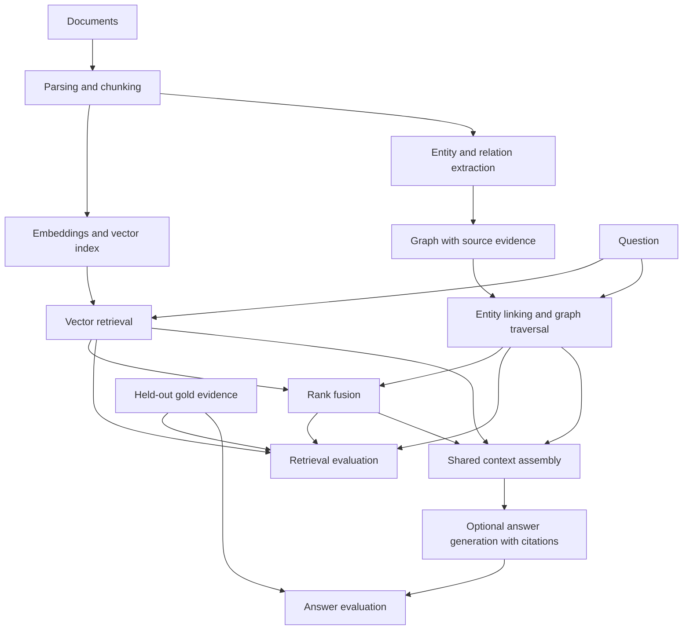

# GraphRAG Bench

When does graph-based retrieval outperform vector retrieval for questions requiring evidence across documents?

GraphRAG Bench is a small research-engineering project for comparing vector, graph, and hybrid retrieval under the same evidence budget. Retrieval quality will be measured independently of answer generation.

**Current milestone: M2 — document ingestion and deterministic chunking.** UTF-8 text and Markdown can be parsed into documents and source-preserving chunks, with reproducible artifact exports. Extraction, graph construction, embeddings, retrieval, and answer generation are not implemented yet. The synthetic fixture is a correctness test, not evidence that one retrieval strategy performs better.

## Quick start

Python 3.11 or newer is required. From this repository:

```bash
python3 -m venv .venv
.venv/bin/python -m pip install -r requirements-dev.txt
.venv/bin/python -m pip install --no-build-isolation -e .
.venv/bin/graphrag-bench validate-fixtures datasets/fixtures/tiny
```

Expected output:

```json
{"chunks": 25, "documents": 8, "entities": 15, "questions": 20, "relations": 23, "status": "valid"}
```

Installation downloads Python dependencies. Validation and tests run offline without model downloads, API keys, or provider calls. Dependency versions are pinned in `requirements-dev.txt`; supported dependency ranges live in `pyproject.toml`.

## Ingest documents

```bash
.venv/bin/graphrag-bench ingest datasets/examples/ingestion \
  --config configs/ingestion.toml \
  --output datasets/processed/m2-example
```

The example produces **2 documents and 4 chunks**, plus a manifest with source hashes, configuration, and implementation versions. Choose a fresh output directory for every run; existing directories are never overwritten. Supported sources are local `.txt`, `.md`, and `.markdown` files encoded as UTF-8. PDF support is deferred.

For a concrete explanation of offsets and overlap:

```bash
.venv/bin/python scripts/study_m2.py
```

Start with the [study guide](docs/study-guide.md), then read the [M2 implementation walkthrough](docs/ingestion.md). It includes the algorithm, exact examples, parameter tradeoffs, provenance rules, test map, and limitations.

## Development checks

```bash
.venv/bin/python -m pytest
.venv/bin/ruff check .
.venv/bin/ruff format --check .
.venv/bin/python -m build --no-isolation
```

GitHub Actions defines these checks for Python 3.11, 3.12, and 3.13. Fixture files are included in the repository and source distribution; the wheel contains the Python package only. The CLI accepts an explicit fixture directory and works outside the repository.

## Implemented components

- `src/graphrag_bench/models.py`: documents, chunks, entities, relation assertions, evidence, benchmark questions, retrieval results, and run manifests.
- `src/graphrag_bench/fixtures.py`: JSONL loading, integrity validation, and fixture-specific ontology configuration.
- `src/graphrag_bench/ingestion/`: text/Markdown parsing, sentence-window chunking, and deterministic exports.
- `src/graphrag_bench/config.py` and `configs/`: validated chunking settings and TOML examples.
- `scripts/study_m2.py`: an executable explanation of chunk overlap and source coordinates.
- `datasets/fixtures/tiny/corpus/`: eight fictional technical documents.
- `datasets/fixtures/tiny/gold/`: manually specified reference chunks, entities, assertions, and 20 questions.
- `tests/`: contract validation, provenance failures, fixture integration, and CLI tests.
- `docs/`: architecture, experiment plan, and data semantics.

The fixture has 25 chunks, 15 entities, and 23 relation assertions. It includes shared entities, an ambiguous alias, a query alias, repeated assertions from different sources, comparisons, and one- and two-hop evidence requirements. Gold benchmark evidence refers to document offsets rather than a particular chunking scheme.

## Architecture

The diagram shows both implemented and planned boundaries. Documents, parsing/chunking, source contracts, artifact exports, and fixture validation exist through M2. Embeddings, extraction, graph construction, retrieval, evaluation metrics, and generation remain planned.



Gold labels are evaluation inputs. They must never become query seeds, extraction instructions, or retrieval inputs. Fixture gold annotations may be used explicitly in isolated tests and labeled oracle diagnostics.

Read the [M0 design and experiment plan](docs/design.md), [data contracts](docs/data-contracts.md), and [fixture notes](datasets/fixtures/tiny/README.md).

## Milestones

1. **M0:** Architecture and experimental hypothesis — complete.
2. **M1:** Repository, contracts, fixtures, offline tests, and basic CI — complete.
3. **M2:** Text/Markdown ingestion, provenance-preserving chunking, reproducible exports, and study documentation — complete.
4. **M3:** Deterministic extraction and graph construction.
5. **M4–M7:** Vector, graph, hybrid retrieval, and retrieval evaluation.
6. **M8–M10:** Real-paper pilot, validated extraction, cited generation, and corpus expansion.
7. **M11–M12:** Comparative experiments, ablations, and error analysis.
8. **M13–M14:** CLI polish, documentation, charts, and release preparation; optional demonstration UI.

Work proceeds one milestone at a time. MIT licensed, including the original fictional fixture corpus.
