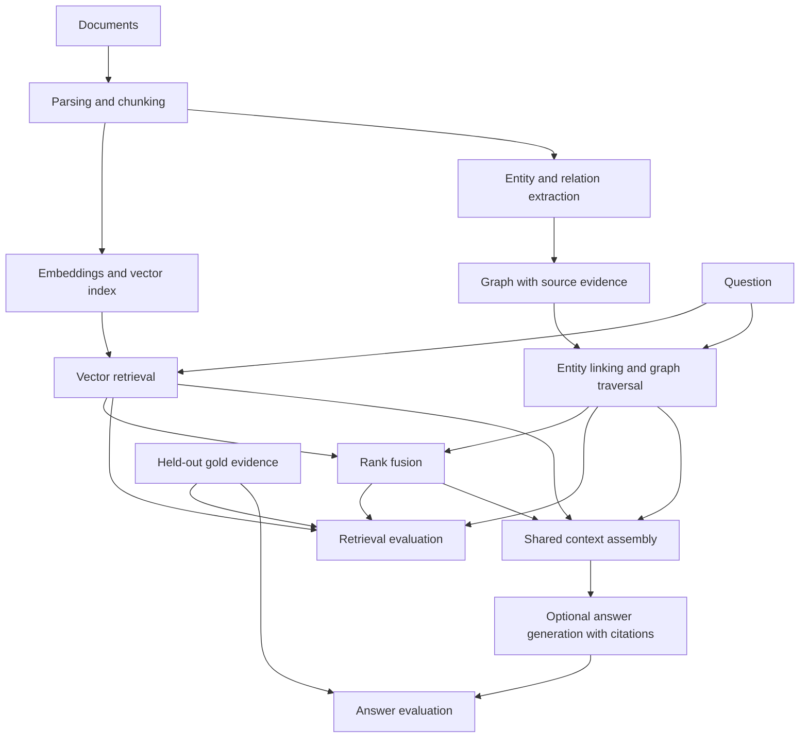

# GraphRAG Bench

When does graph-based retrieval outperform vector retrieval for questions requiring evidence across documents?

GraphRAG Bench is a small research-engineering project for comparing vector, graph, and hybrid retrieval under the same evidence budget. Retrieval quality will be measured independently of answer generation.

**Current milestone: M4 — vector retrieval baseline.** A local retrieval-trained encoder embeds source chunks, and exact cosine search ranks them for a question. Saved indexes preserve chunk identity, model configuration, and input hashes. A separate BM25 baseline provides a lexical sanity check. M1–M3 ingestion and source-backed graph construction remain available. Graph retrieval, hybrid fusion, answer generation, and comparative benchmark results are not implemented yet.

## Quick start

Python 3.11 or newer is required. From this repository:

```bash
python3 -m venv .venv
.venv/bin/python -m pip install -r requirements-dev.txt
.venv/bin/python -m pip install --no-build-isolation -e .
.venv/bin/graphrag-bench validate-fixtures datasets/fixtures/tiny
```

Expected output:

```json
{"chunks": 25, "documents": 8, "entities": 15, "questions": 20, "relations": 23, "status": "valid"}
```

Installation downloads Python dependencies. Validation and unit tests run offline without model downloads, API keys, or provider calls. Core dependency versions are pinned in `requirements-dev.txt`; supported dependency ranges live in `pyproject.toml`. Real neural retrieval uses the separate optional setup below.

## Ingest documents

```bash
.venv/bin/graphrag-bench ingest datasets/examples/ingestion \
  --config configs/ingestion.toml \
  --output datasets/processed/m2-example
```

The example produces **2 documents and 4 chunks**, plus a manifest with source hashes, configuration, and implementation versions. Choose a fresh output directory for every run; existing directories are never overwritten. Supported sources are local `.txt`, `.md`, and `.markdown` files encoded as UTF-8. PDF support is deferred.

For a concrete explanation of offsets and overlap:

```bash
.venv/bin/python scripts/study_m2.py
```

Start with the [study guide](docs/study-guide.md), then read the [M2 implementation walkthrough](docs/ingestion.md). It includes the algorithm, exact examples, parameter tradeoffs, provenance rules, test map, and limitations.

## Build and inspect a graph

After the ingestion command above:

```bash
.venv/bin/graphrag-bench build-graph datasets/processed/m2-example \
  --rules configs/extraction.toml \
  --output datasets/processed/m3-example
.venv/bin/python scripts/study_m3.py
```

The two-file example produces **7 entities, 6 assertion edges, and 0 issues**. The study script uses all eight fixture **source documents**, generates its own chunks, and produces **15 entities, 23 assertion edges, and 2 unsupported numeric statements**. Neither path reads gold annotations for extraction. Graph outputs are `graph.json`, `issues.jsonl`, and `manifest.json`; choose a fresh output directory on repeat runs.

Read the [M3 study walkthrough](docs/extraction-and-graph.md) for a beginner explanation, an evidence-backed two-link example, the exact algorithm, configuration, tests, and limitations. The default grammar expects one statement per line; it is not a general research-paper extractor.

## Retrieve source evidence

For the tested Linux x86_64 / Python 3.12 CPU setup:

```bash
.venv/bin/python -m pip install -r requirements-embeddings-cpu.txt
.venv/bin/graphrag-bench index-vector datasets/processed/m2-example \
  --config configs/embedding.toml --allow-download \
  --output datasets/processed/m4-example
.venv/bin/graphrag-bench query-vector datasets/processed/m4-example \
  --source datasets/processed/m2-example \
  --query "Which model does Alder build on?" --top-k 3
```

The first model setup downloads roughly 91 MB of weights plus the optional CPU libraries. Later commands use the cached pinned revision and local inference; omit `--allow-download` when cached. The two-file example produces a **4 × 384** matrix. Query output includes ranked chunk IDs, scores, original text, and source coordinates. Repeated runs need fresh output directories.

For a lexical comparison or a study session without model setup:

```bash
.venv/bin/graphrag-bench query-bm25 datasets/processed/m2-example \
  --query "Which model does Alder build on?" --top-k 3
.venv/bin/python scripts/study_m4.py
# After model setup, add --semantic for the real 25-chunk neural demonstration.
.venv/bin/python scripts/study_m4.py --semantic
```

Start with the [M4 vector-retrieval walkthrough](docs/vector-retrieval.md). It explains embeddings, cosine similarity, saved indexes, source evidence, the observed retrieval misses, and what remains unmeasured. The synthetic fixture demonstrates mechanics; it does not establish retrieval superiority.

## Development checks

```bash
.venv/bin/python -m pytest
.venv/bin/ruff check .
.venv/bin/ruff format --check .
.venv/bin/python -m build --no-isolation
```

GitHub Actions defines these checks for Python 3.11, 3.12, and 3.13. Fixture files are included in the repository and source distribution; the wheel contains the Python package only. The CLI accepts an explicit fixture directory and works outside the repository.

## Implemented components

- `src/graphrag_bench/models.py`: documents, chunks, entities, relation assertions, evidence, benchmark questions, retrieval results, and run manifests.
- `src/graphrag_bench/fixtures.py`: JSONL loading, integrity validation, and fixture-specific ontology configuration.
- `src/graphrag_bench/ingestion/`: text/Markdown parsing, sentence-window chunking, and deterministic exports.
- `src/graphrag_bench/corpus.py` and `ingestion/reader.py`: cross-record source validation and verified ingestion artifact loading.
- `src/graphrag_bench/extraction/`: configurable statement rules, conservative name resolution, mentions, and diagnostics.
- `src/graphrag_bench/graph/`: validated NetworkX multigraph construction, inspection, and portable graph artifacts.
- `src/graphrag_bench/embeddings/`: replaceable provider contract and optional CPU Sentence Transformers adapter.
- `src/graphrag_bench/retrieval/`: exact vector ranking, verified index artifacts, and a separate BM25 sanity baseline.
- `src/graphrag_bench/config.py` and `configs/`: validated chunking settings and TOML examples.
- `scripts/study_m2.py`: an executable explanation of chunk overlap and source coordinates.
- `scripts/study_m3.py`: an executable explanation of nodes, directed edges, aliases, and source evidence.
- `scripts/study_m4.py`: cosine arithmetic, lexical retrieval, and an opt-in real neural retrieval demonstration.
- `datasets/fixtures/tiny/corpus/`: eight fictional technical documents.
- `datasets/fixtures/tiny/gold/`: manually specified reference chunks, entities, assertions, and 20 questions.
- `tests/`: contract validation, provenance failures, fixture integration, and CLI tests.
- `docs/`: architecture, experiment plan, and data semantics.

The fixture has 25 chunks, 15 entities, and 23 relation assertions. It includes shared entities, an ambiguous alias, a query alias, repeated assertions from different sources, comparisons, and one- and two-hop evidence requirements. Gold benchmark evidence refers to document offsets rather than a particular chunking scheme.

## Architecture

The diagram shows both implemented and planned boundaries. Ingestion, deterministic rule extraction, graph construction, local embeddings, vector retrieval, BM25, and verified artifacts exist through M4. Graph traversal retrieval, hybrid fusion, evaluation metrics, and generation remain planned.



Gold labels are evaluation inputs. They must never become query seeds, extraction instructions, or retrieval inputs. Fixture gold annotations may be used explicitly in isolated tests and labeled oracle diagnostics.

Read the [M0 design and experiment plan](docs/design.md), [data contracts](docs/data-contracts.md), and [fixture notes](datasets/fixtures/tiny/README.md).

## Milestones

1. **M0:** Architecture and experimental hypothesis — complete.
2. **M1:** Repository, contracts, fixtures, offline tests, and basic CI — complete.
3. **M2:** Text/Markdown ingestion, provenance-preserving chunking, reproducible exports, and study documentation — complete.
4. **M3:** Deterministic extraction, graph construction, verified artifacts, and study documentation — complete.
5. **M4:** Local neural embeddings, exact vector retrieval, verified indexes, lexical sanity baseline, and study documentation — complete.
6. **M5–M7:** Graph traversal, hybrid retrieval, and retrieval evaluation.
7. **M8–M10:** Real-paper pilot, validated extraction, cited generation, and corpus expansion.
8. **M11–M12:** Comparative experiments, ablations, and error analysis.
9. **M13–M14:** CLI polish, documentation, charts, and release preparation; optional demonstration UI.

Work proceeds one milestone at a time. MIT licensed, including the original fictional fixture corpus.
