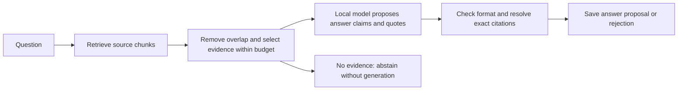

# M9: turn retrieved reports into a cited answer

M9 adds local answer generation on top of BM25, vector, graph, and hybrid retrieval. Every proposed answer claim carries exact quotes from the evidence actually shown to the model. The system saves the complete request and response, checks citation references, and can repeat those checks without loading any model.

**A valid citation reference is not proof of a correct answer.** The model can misunderstand a real quote, omit a necessary connection, or invent a conclusion while citing genuine passages. Accepted answers are explicitly `unreviewed` proposals. The [local observation report](../reports/m9-local.md) records the actual model's successes and failures.

## Start with the Scout story

Imagine two reports on a commander's desk:

> Report A: Eren belongs to Lantern Squad.

> Report B: Lantern Squad guards the east gate.

The question is: **Which gate does Eren's squad guard?**

The search Scouts retrieve the reports. M9 is the writer who reads those reports and drafts: “Eren's squad guards the east gate.” The writer must attach both receipts: one establishes Eren's squad, and the other establishes that squad's gate.

If Report B is missing, the writer should say the available evidence is insufficient. If both reports exist but the writer cites only B, the answer's citation chain is incomplete. A software check can confirm that B exists without realizing A is also needed. That distinction explains why citation references and answer quality require separate checks.

Run the short lesson:

```bash
.venv/bin/python scripts/study_m9.py
```

The lesson uses handwritten responses, not model inference. It shows valid references, missing reports, invented citations, an incorrect conclusion with real quotes, and an incomplete citation chain. It works offline without neural dependencies.

## What happens to one question



1. Run the chosen retriever against verified ingestion artifacts. Graph and vector indexes must belong to that same ingestion run.
2. Select evidence in retrieval order using the existing context-selection algorithm. Remove overlapping source coordinates; retain different documents even if their text is identical. Skip a passage that cannot fit rather than silently clipping it.
3. Assign short labels `S1`, `S2`, and so on to selected source pieces. These labels are local to this answer, not permanent document IDs.
4. Count the actual JSON evidence block with the answer model's tokenizer. Save each candidate's text hash and token count, including candidates skipped by the budget.
5. Send the question and selected source text through the model's chat template. Gold answers, benchmark labels, graph predicates, and ranking scores are not prompt inputs.
6. Parse the answer proposal, resolve every quote inside its named source piece, and compute absolute document coordinates. Reject the whole answer if any proposed citation fails.
7. Save the human-readable answer, structured result, raw model response, prompt, retrieval receipt, and manifest.

The prompt includes original fictional demonstrations of a two-source answer and insufficient evidence. They are development examples, never loaded from benchmark answers. The same prompt, model, and decoding settings apply across all four retrieval strategies.

## Three output states

| Status | Meaning |
| --- | --- |
| `answered` | The model proposed claims that passed format and exact-reference checks; semantic correctness remains unreviewed |
| `insufficient_evidence` | The model abstained, or the software found no selected evidence and skipped generation |
| `invalid_output` | The response hit its output limit or failed format/citation checks; no answer claims were retained |

A provider failure raises an error. It is not disguised as abstention or replaced with a fabricated answer. A successfully saved `invalid_output` run is an inspectable result, not a successful answer; callers should inspect the status, not only the CLI exit code.

## The model's response format

```json
{
  "status": "answered",
  "claims": [
    {
      "text": "Eren's squad guards the east gate.",
      "citations": [
        {"source_id": "S1", "quote": "Eren belongs to Lantern Squad."},
        {"source_id": "S2", "quote": "Lantern Squad guards the east gate."}
      ]
    }
  ]
}
```

Abstention is `{"status":"insufficient_evidence","claims":[]}`. Every answered claim requires at least one citation. The software accepts only known fields, rejects duplicate JSON keys and invalid values, and bounds the number of claims and citations. A quote must occur exactly once within the selected piece. A quote elsewhere in the same document, an omitted overlap, or a budget-skipped passage does not qualify.

The saved citation adds the document ID, chunk ID, title, source URI, exact text, and half-open Unicode character offsets. The model never supplies those coordinates. Markdown rendering escapes generated markup so model-written links or citation-looking text do not become the renderer's source references. The structured citation records remain the authoritative references.

## Run a local answer

The optional CPU dependencies and model are the same as M8. The previously downloaded Qwen model can be reused; no additional model download is needed for graph or BM25 answers. Vector and hybrid retrieval also need the configured embedding model and a matching vector index.

After the ingestion and graph commands in the [M8 walkthrough](llm-extraction.md):

```bash
.venv/bin/graphrag-bench answer datasets/processed/my-m8-input \
  --graph experiments/runs/my-m8-graph \
  --config configs/generation.toml \
  --query "Which dataset evaluates the model used by Orion?" \
  --output experiments/runs/my-m9-answer

cat experiments/runs/my-m9-answer/answer.md

.venv/bin/graphrag-bench replay-answer experiments/runs/my-m9-answer \
  --source datasets/processed/my-m8-input \
  --output experiments/runs/my-m9-replay
```

Choose fresh output directories. Loading is cached-only unless `--allow-download` is explicitly supplied. To require offline operation, set `HF_HUB_OFFLINE=1 TRANSFORMERS_OFFLINE=1`. The CLI prints a JSON summary and the path to `answer.md`; inspect `answer.json` and `receipt.json` when a response is rejected or suspicious.

The default configuration uses graph retrieval. Override the strategy as follows:

| Strategy | Required index flags |
| --- | --- |
| `--strategy bm25` | Neither `--graph` nor `--index` |
| `--strategy vector` | `--index PATH` |
| `--strategy graph` | `--graph PATH` |
| `--strategy hybrid` | Both `--graph PATH` and `--index PATH` |

`--top-k` overrides the retrieval count. The [generation configuration](../configs/generation.toml) also supports `[generation.retrieval.bm25]`, `[generation.retrieval.graph]`, and `[generation.retrieval.hybrid]` tables with the existing retrievers' settings. Their defaults are serialized into every manifest. They are starting settings, not benchmark-tuned choices.

## Two budgets, not one

`context_tokens` limits the actual evidence block, including source labels and JSON formatting. `model.max_input_tokens` limits the complete chat-formatted prompt: instructions, demonstrations, question, and evidence. The provider checks the full input and rejects overflow without truncating the source. The configuration leaves input space beyond the context limit, but a very long question can still exceed the full limit.

`model.max_new_tokens` is a separate generated-output limit. A response stopped by this limit is preserved and rejected, even if its text happens to parse.

M9 uses the generation model's tokenizer for evidence selection. M7 uses the pinned embedding tokenizer for its retrieval comparison. Their token totals are not interchangeable. M9 does not change M7's benchmark or claim a cross-strategy answer-quality result; that study remains later work.

The provider uses the publisher's chat template and avoids adding a second set of special tokens when tokenizing the rendered prompt. See the [Transformers chat-template documentation](https://huggingface.co/docs/transformers/main/chat_templating). The local example model is documented in [Qwen's model card](https://huggingface.co/Qwen/Qwen2.5-0.5B-Instruct).

## What is saved and what replay proves

| Artifact | Contents |
| --- | --- |
| `retrieval.json` | Query, ranking, retrieval settings, verified index-manifest hashes, and available retrieval audit traces |
| `request.json` | Selected source pieces, accepted/skipped chunks, candidate token-count receipts, and exact chat messages |
| `receipt.json` | Request fingerprint and raw completion with tokens, stop reason, and provider-call duration; completion is null for empty context |
| `answer.json` | Proposed claims, resolved source citations, unreviewed status, or validation issues |
| `answer.md` | Escaped human-readable answer proposal and exact source quotes |
| `manifest.json` | Configuration, model specification, environment/code provenance, ingestion hashes, artifact hashes, counts, and execution mode |

Replay verifies the ingestion artifacts, rebuilds context selection from the saved ranking and recorded candidate counts, reconstructs the prompt, revalidates the response, and compares the resulting answer and rendering. It requires no neural imports, model weights, embedding index, or graph directory.

Replay does **not** rerun retrieval, independently recompute tokenizer counts, rerun inference, or establish semantic correctness. It replays recorded decisions and checks their internal consistency against source text. The index-manifest hashes record which retrieval artifacts were used; replay does not authenticate rankings against those absent indexes. Checksums are consistency checks, not signatures against coordinated replacement of all files.

Fresh `answer` calls perform fresh generation; M9 has no response cache. Replay retains the original completion and timing. Identical replay artifacts are a different claim from identical fresh inference on another machine.

## Study questions and an interview explanation

1. **Why are two citations needed for Eren's gate?** One proves the squad membership; the other identifies the squad's gate.
2. **Can a valid quote accompany an invented score?** Yes. Exact-reference checks cannot determine whether the quote entails that score.
3. **Does `answered` mean independently correct?** No. It means a model proposal passed structural and source-reference checks.
4. **What happens when no source fits the budget?** The software abstains without calling generation. The CLI may already have loaded the tokenizer/model to perform budgeting.
5. **Why keep rejected responses?** They reveal whether the failure came from format, references, stopping limits, or model behaviour.
6. **Does replay test whether a model knows the answer?** No. It checks the saved evidence-selection and citation-validation process.

An accurate interview description:

> I added a shared local answer-generation pipeline for four retrieval strategies. It budgets the evidence with the answer model's tokenizer, requests claim-level citations, aligns quotes to source coordinates, and saves reproducible inference receipts. I distinguish resolvable citations from semantic support and document failures such as incomplete citation chains and unsupported answers. Real-paper answer-quality evaluation remains future work.

Code map: `generation/config.py` defines settings; `retrieval.py` routes the existing retrievers; `context.py` records budget decisions; `prompt.py` constructs source-only requests; `generator.py` validates and renders claims; `pipeline.py` saves and replays runs; `contracts.py` defines their records. Tests are in `tests/generation/`.
