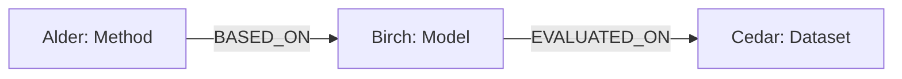

# M3: turn source statements into an inspectable graph

M3 adds deterministic entity and relation extraction, conservative name resolution, and a graph builder. It consumes M2 documents and chunks. Every extracted relationship retains an exact source quote and the chunk that contains it. The current extractor uses a small, explicit grammar; it does not understand arbitrary prose or call a language model.

## 1. Start here: the nontechnical explanation

Imagine several books on a desk. M1 gave us standard record cards for describing their contents. M2 copied the text into manageable pieces and wrote down where each piece came from. M3 now draws a map of the named things and the connections explicitly described in those pieces.

Suppose one book says:

> Alder is a retrieval method built on the Birch model.

Another book says:

> Birch (also called Base) is a language model evaluated on the Cedar dataset.

We can draw this small map:



The circles or boxes are **nodes**: named things, also called **entities**. The connecting arrows are **edges**: statements about relationships. The arrow label tells us what the relationship means. Direction matters: Alder is based on Birch; the text does not say Birch is based on Alder.

An edge in this project is a **relation assertion**: a claim made by a source. We attach a receipt to it: the document, the chunk, the exact quote, and the character positions. This receipt is called **provenance**. Finding the receipt proves where the claim came from. It does not independently prove the claim is true.

The map joins the two books at their shared name, Birch. A later retrieval system could use that connection to collect evidence spread across documents. M3 builds and inspects the map. It does not yet take an arbitrary question, find a route, rank evidence, or write an answer.

## 2. Run the teaching example

From the repository root after installing the dependencies in the README:

```bash
.venv/bin/python scripts/study_m3.py
```

The script reads only `datasets/fixtures/tiny/corpus/documents.jsonl`, generates chunks using `max_units=1` and `overlap_units=0`, loads the grammar, extracts predictions, and builds the graph. It does not read `gold/`, benchmark questions, or expected answers. Its chosen Alder example is a teaching demonstration, not an implemented question-answering strategy.

Expected results:

| Observation | Result | Why it matters |
| --- | --- | --- |
| Source documents / generated chunks | 8 / 25 | The graph uses the same source records available to future retrieval |
| Entities / assertion edges | 15 / 23 | Named things and source claims are separate records |
| First link | Alder `BASED_ON` Birch | Supported by `doc-alder`, characters `[0, 53)` |
| Second link | Birch `EVALUATED_ON` Cedar | Supported by `doc-birch`, characters `[0, 76)` |
| Alias `QZ` | Quartz | One unambiguous alternative name |
| Alias `Base` | Birch and Elm | Two candidates; the system does not choose one |
| Cedar `REPORTS` Accuracy | Two edges | Two documents make this claim |
| Unsupported statements | Two numeric counts | Counts remain in source chunks, without invented graph relations |

`[0, 53)` means “start at character 0 and stop before character 53.” Counting starts at zero. The same coordinates work against the original stored document, regardless of how many chunks overlap that text. These are Unicode character positions, not bytes or model tokens.

## 3. Build artifacts you can open

The smaller two-file ingestion example is separate from the eight-document teaching corpus:

```bash
.venv/bin/graphrag-bench ingest datasets/examples/ingestion \
  --config configs/ingestion.toml \
  --output datasets/processed/m3-input
.venv/bin/graphrag-bench build-graph datasets/processed/m3-input \
  --rules configs/extraction.toml \
  --output datasets/processed/m3-graph
```

Expected CLI counts: **2 documents, 4 chunks**, then **7 entities, 6 assertions, 0 issues**. Choose new directory names if these already exist. Output directories are never overwritten. An existing M2 ingestion directory can also be used directly; ingestion need not be repeated.

The graph command writes:

| File | Contents |
| --- | --- |
| `graph.json` | Canonical entities, aliases, mentions, and relation assertions with evidence |
| `issues.jsonl` | One diagnostic per line; an empty file means no reported issues |
| `manifest.json` | Input file hashes, rules and their fingerprint, implementation versions, counts, and output hashes |

To inspect a graph in Python:

```python
from pathlib import Path
from graphrag_bench.graph.pipeline import load_graph

graph = load_graph(
    Path("datasets/processed/m3-graph"),
    Path("datasets/processed/m3-input"),
)
alder = graph.lookup("Alder")[0]
for assertion in graph.outgoing(alder.entity_id, "BASED_ON"):
    print(graph.entity(assertion.object_id).name)
    for evidence in assertion.evidence:
        print(evidence.document_id, evidence.chunk_id, evidence.text)
```

`lookup` always returns a tuple of candidates. In this known example there is exactly one Alder. Application code must handle zero or multiple candidates instead of blindly taking the first one. `incoming`, `outgoing`, `entity`, and `snapshot` inspect existing records; they do not perform question interpretation or relevance ranking.

## 4. How extraction works, step by step

The main function is `extract(documents, chunks, rules)` in [extractor.py](../src/graphrag_bench/extraction/extractor.py). The following sequence is deterministic: no randomness, network requests, embeddings, or model calls.

1. **Check the source records.** `CorpusIndex` rejects duplicate document/chunk IDs, incorrect source slices, missing document references, and noncontiguous chunk ordinals. Ordinals must start at zero for each document.
2. **Identify statement lines.** Read source lines, excluding blank lines, ATX headings, and fenced code. Leading/trailing whitespace changes the selected offsets, not the stored source text. A line must fit completely inside at least one chunk. Otherwise emit `uncovered_statement` and skip its extraction. This prevents a graph edge from claiming evidence that no available chunk contains.
3. **Match an explicit syntax rule.** Apply each configured regular expression to the entire line. Exactly one rule must match. Zero matches produce `unmatched_statement`; multiple matches produce `multiple_rules`. Rules are never resolved by taking the first one. A required capture that is absent or blank produces `invalid_capture`.
4. **Register explicit declarations first.** A declaration introduces a canonical name, a type, and optionally an alias. Read all declarations before resolving references so that document order cannot decide the meaning of an alias.
5. **Register typed references.** A typed reference such as “the Ocean dataset” can introduce an entity when no known name or alias matches. A unique typed alias resolves to the existing entity. An ambiguous alias does not introduce a replacement entity.
6. **Resolve relation endpoints.** A subject without an explicit type must resolve to exactly one known entity. Missing or ambiguous subjects produce `unknown_entity` or `ambiguous_entity`, and the relation is skipped. A clear declaration identifies its own subject even when its spelling is also someone else's alias.
7. **Create source-backed assertions.** Store subject, predicate, object, all containing chunks, exact source coordinates/text, extraction method, and an implementation/rules version. No reverse edge or inferred shortcut is created.
8. **Collect mentions.** Typed captures identify their own occurrences. Other known names and aliases are matched with word boundaries across non-heading, non-code statement lines, including unsupported lines. A mention needs to fit inside a chunk even when the surrounding statement does not. Ambiguous occurrences produce `ambiguous_mention` and are not assigned to one candidate. This preserves the Cedar mention in “Cedar contains 1200 examples” without claiming to extract the number as a relation.
9. **Sort the result.** Entities, assertions, mentions, and diagnostics have stable ordering. Reversing the documents, chunks, or rule order does not change extraction results.

Scanning source lines establishes coordinates and statement boundaries. Chunk containment controls what can become an assertion. M3 does not concatenate fragments from separate chunks into a new quote.

## 5. What the rules mean

[configs/extraction.toml](../configs/extraction.toml) contains the grammar and type/predicate labels. No fixture entity names, benchmark questions, or answers occur in that configuration. A **regular expression** is a text pattern. Named capture groups identify the subject, object, and optional alias inside a matching statement.

For example:

```toml
[[rules]]
rule_id = "uses-encoder"
pattern = '(?P<subject>[\w-]+) uses the (?P<object>[\w-]+) encoder\.'
object_type = "Encoder"
predicate = "USES"
```

For `Birch uses the Quartz encoder.`, `subject` captures `Birch` and `object` captures `Quartz`. The suffix “encoder” supplies the object's type. The subject's type must already be established elsewhere. `\.` means a literal final period. TOML single-quoted strings preserve the backslashes.

The default rules cover `BASED_ON`, `USES`, `TARGETS`, `EVALUATED_ON`, `MEASURED_BY`, `SUPPORTS_TASK`, and `REPORTS`, plus standalone Model/Encoder declarations. The labels remain open strings in the contracts. Adding a different type or predicate does not require a new model enum. A test demonstrates a custom Author/Paper rule.

The default syntax uses single word/hyphen tokens for most names and allows multiple words for task phrases. It requires the demonstrated capitalization of grammar words, punctuation, and one complete statement per line. Name lookup itself normalizes case, Unicode NFC, and runs of whitespace. Source quotes are never normalized. General mention matching is conservative; arbitrary Unicode spelling variants are not a linguistic entity linker.

Rules are trusted local configuration and use Python's regex engine without a timeout. Keep patterns small and review them. Changing a grammar can change what is extracted even when the input documents stay the same; the rules fingerprint makes that change visible.

## 6. Identity, aliases, and duplicate evidence

**An entity is not just a displayed word.** Identity combines a normalized canonical name with its exact type label. Two occurrences of Birch as a Model merge into one entity. The same spelling used for a Model and a Dataset remains two entities. Type labels are case-sensitive identifiers; `Model` and `model` are different types.

The normalizer applies Unicode NFC, case folding, and collapsed whitespace. If several display variants share an identity, the lexicographically smallest supplied canonical spelling is used for stable output. This is deterministic string matching, not a claim to solve real-world identity: two different models with the same name and type would merge incorrectly. Conversely, differently named entities will remain separate unless an explicit alias connects references to a declaration. Conflicting canonical declarations are not automatically reconciled through a shared alias.

**Aliases can be shared.** “Birch (also called Base)” associates that occurrence of Base with Birch. “Elm (also called Base)” associates its occurrence with Elm. A later bare `Base` has two candidates. The system preserves that ambiguity instead of relying on file order. A type restriction may help only when the candidates have different types.

**A repeated chunk is not a second source claim.** If overlapping chunks both contain the same statement, extraction creates one assertion with both chunk references. That helps later retrieval trace either chunk back to the same claim. It must not be counted as two independent facts during evaluation.

**A different source is a separate assertion.** Cedar `REPORTS` Accuracy occurs in `doc-cedar` and `doc-lumen`. Both edges survive. M3 does not decide whether repeated claims are independent corroboration or copied text. A repeated sentence at a different location in the same document likewise receives a separate assertion identity.

## 7. Graph construction and why NetworkX fits here

The graph is a NetworkX `MultiDiGraph`. “Directed” preserves who relates to whom. “Multi” permits several assertion edges between the same pair of entities. Each edge key is its assertion ID, so different sources or predicates cannot silently overwrite one another. The [NetworkX class documentation](https://networkx.org/documentation/stable/reference/classes/multidigraph.html) describes these backend semantics.

NetworkX stores and indexes the connections. Our code owns extraction, identity resolution, validation, and provenance. It is not delegating the research logic to a GraphRAG framework. Version 3.6.1 is pinned for development; the runtime range remains below 3.7 to retain the project's Python 3.11 support.

Before adding edges, the builder validates unique entity/assertion IDs, known endpoints, exact evidence slices, chunk containment, and mention/name agreement. This explicit endpoint check matters because NetworkX can otherwise create missing nodes automatically. The backend's structure is frozen after construction. Inspection returns defensive copies so mutating a returned qualifier dictionary cannot alter the stored graph.

The builder accepts the open M1 contracts, including parallel predicates and qualifiers. Default extraction emits no qualifiers. A source condition, uncertainty, negation, or contradiction must not be silently discarded to fit a positive relation. The narrow default syntax leaves such unsupported statements unextracted; it does not understand those linguistic features.

The graph validates structural consistency, not semantic entailment. It cannot prove that a supplied quote truly supports its relation, reconcile contradictions, or establish which source is correct. `TraversalPath` still validates only record shape; query-driven traversal and path verification are future M5 work.

## 8. Stable IDs and reproducible artifacts

Generated IDs use full SHA-256 digests of structured strings, never Python's process-dependent `hash()`:

| Record | Identity inputs |
| --- | --- |
| Entity | Exact entity type and normalized canonical name |
| Assertion | Extractor/rules version, document ID, statement offsets/text, and resolved subject/predicate/object |
| Chunk | M2's existing content, source, configuration, and span inputs; unchanged by M3 |

Assertion IDs exclude chunk IDs. Rechunking the same `Document` can keep an assertion's identity while changing its evidence chunk references, provided the entire statement still fits in a chunk. Changing the source document identity, statement location, rule fingerprint, or extraction version changes assertion identity. Aliases do not independently determine entity IDs.

The ingestion reader verifies the exact document/chunk file hashes and then checks record consistency, counts, source identities, section partitions, and per-document chunks. It cannot recheck raw-file hashes without the original files. The graph manifest stores the hashes of those two files **and the ingestion manifest**, binding the graph to a specific ingestion export.

The graph loader verifies the graph and issue file hashes, rules fingerprint, counts, input hashes, extraction-version consistency, issue coordinates, and all graph provenance again. It requires the ingestion directory to load a saved graph. A manifest containing unexpected artifact filenames is rejected before those filenames can be read.

Serialization uses sorted JSON keys, stable record ordering, UTF-8, and a final newline. Repeating a build with the same inputs, rules, and implementation/dependency versions produces identical files. Output paths and timestamps are excluded. Different dependency/package versions are recorded and can change the manifest even when the graph itself is identical. Reordering rule entries leaves extraction unchanged, but changes the configuration order recorded in the manifest.

Output is written only after input validation and graph construction. The manifest is written last as a completion marker. An I/O failure can leave a partial new directory; require a valid manifest and matching hashes before consuming it. Checksums detect corruption against a supplied manifest. They are not signatures and do not protect against someone deliberately replacing both data and manifest.

## 9. Verification and code-reading map

M3's complete local suite passes **185 tests**, including the original 130 M1/M2 tests. The teaching scripts and CLI commands also run in CI, whose matrix is Python 3.11, 3.12, and 3.13. Local execution during this milestone used Python 3.12; the other interpreters require CI or equivalent environments.

Read the implementation in this order:

| File | What to study |
| --- | --- |
| `scripts/study_m3.py` | Follow one concrete example before reading internals |
| `extraction/config.py`, `configs/extraction.toml` | Validated rules, captures, and open labels |
| `extraction/registry.py` | Entity identity and plural alias candidates |
| `extraction/extractor.py` | Passes, exact evidence, and diagnostics |
| `corpus.py` | Cross-record source coordinates and chunk containment |
| `graph/builder.py` | Directed assertion edges and validation |
| `ingestion/reader.py`, `graph/pipeline.py` | Artifact verification, export, and round-trip loading |
| `serialization.py` | Shared deterministic JSON bytes |

Focused checks:

```bash
.venv/bin/python -m pytest tests/test_extraction.py tests/test_graph.py tests/test_graph_artifacts.py -q
.venv/bin/python scripts/study_m3.py
```

The tests compare source-only extraction against hand-written gold annotations, keep alias collisions unresolved, check unfamiliar names and custom ontology labels, reject nonmatching negative/hypothetical statements, preserve repeated sources, deduplicate overlapping chunk evidence, reject broken references/quotes, and verify deterministic exports and reloads. Gold labels enter the comparison assertions in tests; they never enter the extractor API or graph CLI inputs.

These are correctness checks for the implemented grammar. Matching all 23 fixture assertions is not a measured extraction score on unseen papers and does not show a retrieval advantage. M7 will define retrieval metrics on appropriate benchmark data.

## 10. Exercises with explanations

1. **Why is Birch drawn once although it occurs in several documents?** Its normalized canonical name and Model type identify one shared node. Its mentions still retain separate locations.
2. **Why keep two Cedar–Accuracy edges?** They are two source assertions. Collapsing them would discard provenance. Future evaluation must avoid counting them as two different semantic facts automatically.
3. **What should happen to “Base uses the Lumen reranker”?** Unless additional information resolves the name, skip the relation and report ambiguity. Birch and Elm are both Models, so a Model type filter cannot resolve this case.
4. **What happens if `max_chars` cuts a statement into fragments?** If no chunk contains the entire source line, M3 reports `uncovered_statement`. Smaller chunks can therefore remove graph evidence even though every source character remains available across chunks.
5. **Why can the graph not directly answer “How many examples are in Cedar”?** The number remains in the text but has no extracted numeric relation. The retained Cedar mention points to a chunk that a later retriever might collect. That retrieval behavior is not implemented yet.
6. **Why not add an Alder–Cedar edge automatically?** The source contains two differently labeled relationships. Flattening them into a new relation would invent a claim and hide the reasoning chain and its two sources.

To experiment safely, copy the example files into a new source directory. Add a negative statement, a shared alias, or an unfamiliar name using a supported sentence form. Ingest into a fresh directory, build into another fresh directory, and inspect `issues.jsonl` alongside `graph.json`. Change only one factor at a time.

## 11. Current limits and milestone boundary

- The rule extractor expects controlled, one-statement-per-line English. Wrapped prose, multiple sentences per line, lists, quotations, pronouns, conditions, numeric attributes, and arbitrary names/definitions are not generally supported. Even valid M2 text can fall outside this grammar.
- Heading/fence skipping is a structural convenience, not a complete Markdown parser. The same line filter applies to text and Markdown records; source text remains unchanged.
- Matching uses deterministic names and types, not semantic identity. Same-name entities can merge incorrectly, and differently named references can remain disconnected.
- Whole-line evidence must fit in one chunk. Mention evidence can be smaller. Neither provides a guarantee that the eventual retrieval system will find the needed source.
- The graph and name matching operate in memory and scan records. No scale or latency claims are made for a real-paper corpus.
- No vector embeddings, query interpretation, graph retrieval ranking, hybrid fusion, answer generation, or measured GraphRAG benefit exist yet. M4 adds the vector baseline; M5 adds graph traversal retrieval; later milestones expand extraction and evaluation.

M3 establishes a source-backed map we can inspect and test. Keep that construction result separate from the future research question of when following the map actually retrieves better evidence.
