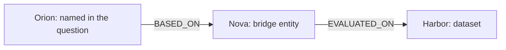

# M5: follow graph relationships to retrieve evidence

M5 adds query-name linking, bounded graph traversal, source evidence collection, and an explicit ranking rule. It consumes M2 ingestion artifacts and an M3 graph. It uses neither embeddings nor benchmark labels. M4's vector and BM25 baselines remain independently usable; the subsequent [M6 milestone](hybrid-retrieval.md) combines vector and graph rankings.

## 1. Start with an everyday picture

Suppose you have a map with three places and two connecting roads. Starting at the first place, following one road reaches the second; following another reaches the third. M5 does something similar, but our places are named things, our roads are source assertions, and the destination is evidence you can read.

Consider two source documents:

> Orion is a retrieval method built on the Nova model.

> Nova is a language model evaluated on the Harbor dataset.



For “Which dataset evaluates the model that Orion is based on?”, the name Orion supplies the starting point, or **seed**. Nova connects the documents. Following two assertions can collect both supporting quotes even though the second document does not mention Orion.

A **hop** is one graph edge followed. A **path** records the entity IDs and assertion IDs followed in order. A path is an audit trail for finding evidence, not a generated answer and not a new source claim. M5 does not invent a direct Orion–Harbor assertion.

## 2. Run the teaching example

The demonstration needs the core dependencies only. It runs offline without neural model setup:

```bash
.venv/bin/python scripts/study_m5.py
```

The first example generates its own two source documents and builds the graph with M3's normal rules. It never reads gold annotations. With **relation evidence only** and outgoing traversal, it checks:

| Maximum hops | Retrieved chunks | Explanation |
| --- | --- | --- |
| 0 | 0 | Starting at a node does not follow an assertion |
| 1 | 1 | The Orion–Nova assertion supplies the first source |
| 2 | 2 | The Nova–Harbor assertion supplies the other source |

The script prints the two exact quotes and their source coordinates, then validates the two-edge path. It also demonstrates ambiguous aliases and the larger fixture's ranking limitations.

**An important wrinkle:** the default retriever also collects entity **mentions**, places where an entity's name occurs. After one edge reaches Nova, Nova's mention in the second document can already reveal its Harbor statement. With mentions enabled, both source chunks appear after one traversal hop in this example. Therefore “one-hop retrieval” does not automatically mean “only one-hop factual evidence.” Every ablation must record whether mentions are included.

## 3. Query a saved graph

For a complete fresh run:

```bash
.venv/bin/graphrag-bench ingest datasets/examples/ingestion \
  --config configs/ingestion.toml --output datasets/processed/m5-input
.venv/bin/graphrag-bench build-graph datasets/processed/m5-input \
  --rules configs/extraction.toml --output datasets/processed/m5-graph
.venv/bin/graphrag-bench query-graph datasets/processed/m5-graph \
  --source datasets/processed/m5-input \
  --config configs/graph-retrieval.toml \
  --query "Which dataset evaluates the model that Alder is based on?" \
  --top-k 5
```

Existing valid M2/M3 artifact directories also work directly, including those created before M5. The source directory is required so graph evidence can be verified against its original documents and chunks. Querying does not write new files or change the stored graph.

The output JSON includes:

| Field | Meaning |
| --- | --- |
| `result` | Standard `RetrievalResult`: ordered unique chunks, ordinal scores, paths, and elapsed time |
| `evidence` | Original chunk records, in result order |
| `links` | Matched normalized names and all candidate entity IDs |
| `ranking` | Seed-group indices and minimum hop count explaining each returned chunk's order |
| `admitted_paths` | Number of paths admitted, including zero-edge seed paths |
| `candidate_chunks` | Distinct evidence chunks found before applying top K |
| `limits_reached` | Whether neighbor, parallel-assertion, or total-path caps pruned traversal |
| `config`, `retrieval_version` | The effective settings and algorithm identifier |
| `entities`, `assertions` | Records referenced by query links and returned paths, for inspection |

The last two record lists are **audit metadata**. They may mention entities or quote assertions whose chunks did not survive the top-K cutoff. Future answer generation and evidence-budget evaluation must assemble context from `result.hits` and their source chunks, not from the entire diagnostic JSON. A saved path is not permission to add unranked source text to the context budget.

## 4. How query names become seeds

`link_query` uses only names and aliases present in the extracted graph. It does not receive gold relevant entities, bridge labels, expected answers, or vector results.

1. Normalize both query and graph surfaces with Unicode NFC, case folding, and collapsed whitespace. These normalized surfaces are labels, not offsets into the original query.
2. Match whole surfaces. Word characters and hyphens cannot extend either boundary, so `Quartzite` and `Quartz-v2` do not match a node named only `Quartz`.
3. Prefer longer overlapping matches. A `New York` match takes precedence over the `York` substring inside it. A separate occurrence of York can still match independently.
4. Keep all candidates for a shared surface. `Base` links to both Birch and Elm; no arbitrary winner is chosen.
5. Merge surfaces with identical candidate sets into a **seed group**. For example, `Quartz` and `QZ` identify the same one-node set and count as one group, even if both occur in a question. Repeating a name also does not add weight.

Overlapping but unequal candidate sets remain separate groups. For example, `Birch` and ambiguous `Base` are not automatically reconciled. This simple linker does not use surrounding grammar to disambiguate them. The ranking measures coverage of the declared groups, not independent real-world concepts or probabilities.

A question with no linked graph names returns an empty result. There is no automatic vector or BM25 fallback. If all linked candidate entities exceed `max_seeds`, retrieval fails explicitly rather than silently dropping one interpretation of an ambiguous alias.

## 5. The bounded traversal

The retriever builds adjacency lists from the validated graph, applying the configured direction and predicate filter. It starts a **breadth-first** queue: all zero-edge seed paths come first, followed by admitted one-edge paths, then two-edge paths.

For each admitted path:

1. Collect the source chunks supporting every assertion on that path. This includes bridge statements earlier in the walk.
2. If enabled, also collect source chunks containing mentions of the terminal entity. A zero-edge path therefore collects seed mentions.
3. Associate each chunk with the seed group(s) represented by the path's starting entity. Keep all distinct supporting paths; repeated discovery does not duplicate the chunk hit.
4. If the hop limit allows another edge, enumerate eligible neighbors in ascending entity-ID order, then parallel assertions in ascending assertion-ID order.
5. Apply the neighbor, assertion, and global path caps. Add surviving extensions to the queue.

An entity cannot repeat within a generated path, preventing cyclic walks. Self loops are also not traversed. Different paths to the same entity remain eligible; a global “already visited node” flag would incorrectly discard alternative sources and query-seed routes.

All evidence references are validated against the original documents/chunks. The retriever refuses a graph paired with a different corpus. Before returning a path with a chunk, it checks that the path is connected in the configured direction and that the chunk supports an edge on the path or a permitted terminal mention.

## 6. Traversal direction is not assertion direction

The graph stores directed claims. Nova `EVALUATED_ON` Harbor always retains that direction.

- `outgoing` follows subject to object.
- `incoming` follows object to subject.
- `both` allows either direction when locating evidence.

Starting from Harbor and following the incoming edge reaches Nova's source assertion. It does **not** create a claim that Harbor was evaluated on Nova. The original subject, predicate, object, and quote remain available in the assertion record.

`KnowledgeGraph.validate_path` checks entity/assertion existence, path shape, adjacency, and allowed direction. The M1 `TraversalPath` record itself still checks shape only; validation against a concrete graph supplies the additional guarantees.

## 7. How candidates are ranked

The ranking follows the M0 baseline plan. For every candidate chunk, calculate:

1. **Seed-group coverage:** how many linked query groups reached that chunk. More comes first.
2. **Shortest recorded path:** fewer traversal edges comes next.
3. **Chunk ID:** ascending order resolves exact ties reproducibly.

Coverage comes from actual recorded paths starting at linked candidate entities. A shared alias with two candidates still counts as one group. Several overlapping chunks or parallel paths do not multiply its group count.

The standard result contract requires a numeric `score`. M5 encodes the final ordering as `candidate_count − zero_based_rank`. For 19 candidates, scores start at 19, 18, 17, and so on. These are **ordinal scores**, not cosine similarities, probabilities, or calibrated relevance estimates. `ranking` exposes the actual sorting criteria. Future rank fusion should use rank positions rather than average these scores with M4 scores.

The ranking does not interpret whether the question asks for a dataset, metric, author, or method. Questions with the same linked groups and settings receive the same ordering. This is deliberately an inspectable structural baseline, with an explicit limitation to evaluate later.

## 8. Limits, diagnostics, and ablations

[configs/graph-retrieval.toml](../configs/graph-retrieval.toml) records every traversal setting:

| Setting | Default | Effect |
| --- | --- | --- |
| `max_hops` | 2 | Allowed values are 0, 1, 2 for the initial ablations |
| `direction` | `both` | Traversal direction; source assertions remain directed |
| `max_neighbors` | 16 | Distinct eligible neighbors admitted per expanded path |
| `max_assertions_per_neighbor` | 4 | Parallel assertions retained for each selected neighbor |
| `max_paths` | 256 | Global admitted paths, including zero-edge seed paths |
| `max_seeds` | 16 | Maximum candidate starting entities; excess is an error |
| `include_mentions` | `true` | Collect terminal entity mention chunks as well as edge evidence |
| `predicates` | empty | All edge labels; otherwise only listed predicates can be traversed |

`max_paths` must be at least `max_seeds`. Reaching a traversal cap is reported in `limits_reached`; top-K selection is separate and does not set that flag. “No limits reached” does not mean the returned top K contains all useful evidence.

Caps use stable IDs for admission, not semantic importance. A lower-ID branch can be admitted while a useful higher-ID branch is pruned. The global queue cap can also favor seeds encountered earlier. These controls bound exploration, but they are not recall-preserving optimizations. They must be reported and ablated before making quality claims.

The predicate filter controls traversed edges only. With mentions enabled, a returned chunk can also contain statements using other predicates or unsupported numeric facts. With mentions disabled and `max_hops=0`, there is no evidence to collect.

Use CLI hop/direction overrides for quick checks:

```bash
.venv/bin/graphrag-bench query-graph datasets/processed/m5-graph \
  --source datasets/processed/m5-input --query "Alder" --max-hops 0
.venv/bin/graphrag-bench query-graph datasets/processed/m5-graph \
  --source datasets/processed/m5-input --query "Cedar" \
  --max-hops 2 --direction incoming
```

For other changes, copy the TOML into a new configuration file. Change one factor at a time. In particular, freeze `include_mentions` when comparing hop limits so its extra evidence does not get mistaken for a traversal-depth effect.

## 9. What works, and what the larger example exposes

The minimal Orion–Nova–Harbor example establishes that relation-only two-hop retrieval can recover two linked source assertions across documents. It also validates every returned path and quote.

On the full 25-chunk fixture, the default Alder question admits **13 paths** and discovers **19 candidate chunks**, without hitting a traversal cap. Its default top five are:

1. Alder uses the Lumen reranker.
2. Alder targets evidence retrieval.
3. Alder is a retrieval method built on the Birch model.
4. Birch uses the Quartz encoder.
5. Drift uses the Lumen reranker.

The Birch–Cedar statement is reachable but does not appear in that top five. Seed mentions rank early, and several nearby chunks tie on the structural criteria. Stable chunk IDs break those ties without understanding the requested relationship. We keep this failure visible rather than changing the algorithm to force this example to succeed.

This separates three possible failure stages: linking the right starting name, reaching the needed source, and ranking it inside the evidence budget. A graph can succeed at the first two and still fail the third. M5 is therefore not evidence that GraphRAG beats the vector baseline. M6 adds fusion, and M7 supplies the evaluation needed to compare strategies fairly.

## 10. Read the implementation in this order

| File | What to study |
| --- | --- |
| `scripts/study_m5.py` | The worked chain, hop checks, ambiguous alias, and top-K miss |
| `retrieval/linking.py` | Surface matching and explicit candidate groups |
| `retrieval/graph_config.py` | Validated traversal settings |
| `retrieval/graph.py` | Breadth-first queue, evidence collection, ranking, and trace |
| `graph/builder.py` | Assertion lookup and concrete graph-path validation |
| `cli.py` | Verified artifact loading and inspectable output |
| `tests/test_graph_retrieval.py` | Hop, direction, ambiguity, provenance, limits, and ranking cases |
| `tests/test_graph_query_cli.py` | End-to-end querying without model or gold inputs |

The public API offers `retrieve(query, top_k=...)` for the common `RetrievalResult` and `retrieve_with_trace(...)` when explanations are needed. The graph's configuration is fixed after retriever construction so changing a setting cannot leave stale adjacency lists. M5 also makes the M4 provider's configuration read-only, preserving agreement with its recorded embedding specification.

`elapsed_ms` measures linking, traversal, ranking, and returned-path validation with the graph/corpus already loaded. It excludes artifact reads, graph construction/validation at initialization, process startup, and JSON serialization. Memory and preprocessing still scale with graph size; caps bound admitted traversal paths, not the cost of scanning all names or preparing adjacency lists.

## 11. Verification

At M5 completion, **272 local tests pass**, including the previous 247. The new tests cover zero/one/two-hop relation retrieval, the mention-expansion distinction, incoming/outgoing direction, shared aliases, Unicode and boundary matching, numeric mention evidence, separate source assertions, hub/path caps, cycles, ordinal ordering, invalid provenance, and the CLI. CI runs the offline study scripts and graph query on Python 3.11/3.12/3.13; local execution used Python 3.12.

```bash
.venv/bin/python -m pytest tests/test_graph_retrieval.py tests/test_graph_query_cli.py -q
.venv/bin/python scripts/study_m5.py
```

No benchmark metric, statistical result, or answer-quality claim is produced by these checks. The graph still depends on M3's deliberately limited extraction grammar and name identity assumptions. Misspelled or implicit query entities can fail to link; shared hubs can broaden the candidate set; source conflicts remain separate claims.

## 12. Exercises with answers

1. **What is the seed in the Orion question?** Orion. Nova and Harbor must come from graph traversal or source mentions, not gold query hints.
2. **Why keep both Base candidates?** The graph says Base names two models. The query linker has no justified basis to choose one.
3. **Does an incoming walk reverse the fact?** No. It changes how we locate the stored assertion, not the assertion's subject and object.
4. **Why can one hop collect both facts when mentions are enabled?** Reaching Nova exposes its mention in the other source chunk, even without following the Nova–Harbor edge.
5. **Why can top K be incomplete even when no cap was reached?** Candidate discovery and ranking are different stages. Useful evidence may rank below K.
6. **Why is score 19 not stronger evidence than vector score 0.65?** The graph score records ordinal position; the vector score measures cosine similarity. Their scales have different meanings.
7. **Why not give every retrieved path's quotes to a future answer model?** That could exceed the declared top-K/context budget. Trace metadata is for inspection; context assembly must enforce a shared evidence budget.

M5 is complete. Continue with the implemented [M6 walkthrough](hybrid-retrieval.md): combine independent rankings with an explicit, testable fusion rule.
