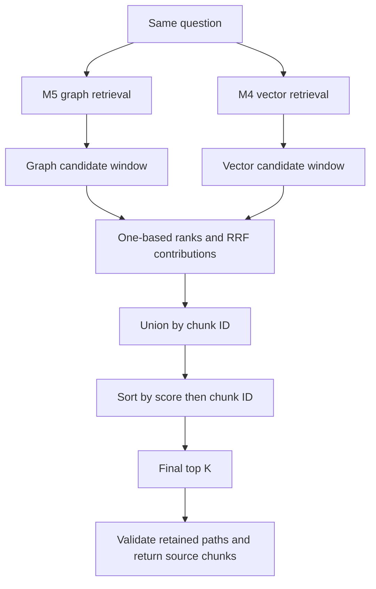

# M6: combining vector and graph retrieval

M6 implements hybrid retrieval: ask the existing vector and graph retrievers for candidates, combine their rankings, and return source evidence. It follows the reciprocal rank fusion rule chosen in the [M0 design](design.md). This milestone does not add an answer-writing model, a reranker, a token-budget context assembler, or benchmark metrics.

## Start without technical knowledge

Imagine asking two librarians to find useful passages for a question.

The first librarian looks for passages whose wording and meaning resemble the question. This is our **vector retriever** from M4. The second librarian looks at a map of named things and follows their connections to the passages that support them. This is our **graph retriever** from M5.

Each librarian gives us an ordered list. We need one final reading list. Simply joining their lists would include duplicates and would not tell us which passages to read first. M6 gives each passage points according to where it appears in each list, adds those points, and sorts the combined list.

A passage appearing near the top of both lists often receives more points than a passage appearing in only one. That is agreement between two search methods. It is **not proof that the passage answers the question**. Both methods can prefer the same irrelevant material.

Nothing new is written into the source documents. Every selected passage still has its original document ID, text, and character coordinates. If the graph contributed a path for that passage, we keep the path too.

## Run the teaching example first

From the repository root, after the normal development installation:

```bash
.venv/bin/python scripts/study_m6.py
```

The default demonstration is entirely offline and needs only the core dependencies. It uses deliberately hand-written rankings to explain four things:

1. How a passage earns points from two lists.
2. Why collecting candidates and selecting the final results are different steps.
3. How the fusion constant changes the influence of rank.
4. How adding noisy graph results can remove useful evidence from the final selection.

These examples teach the mechanism. They are not outputs from a neural model and are not benchmark results. The optional `--semantic` mode later in this guide uses the actual M4 model.

## The exact arithmetic

We use **reciprocal rank fusion**, abbreviated RRF. Rank means position in a list: first is rank 1, second is rank 2, and so on. For a chunk `d`:

```text
vector contribution = 1 / (c + vector rank), if present; otherwise 0
graph contribution  = 1 / (c + graph rank),  if present; otherwise 0
hybrid score        = vector contribution + graph contribution
```

The constant `c` is nonnegative. Our initial value is 60. The [original RRF paper by Cormack, Clarke, and Büttcher](https://cormack.uwaterloo.ca/cormack/cormacksigir09-rrf.pdf) describes the rank-based sum and used 60 following a pilot investigation. That historical choice does not establish the best setting for this project. Our planned development comparison remains 10, 60, and 100.

Consider vector order `[a, b, c]` and graph order `[b, d, a]`:

| Chunk | Vector rank | Graph rank | Calculation with constant 60 | Score |
| --- | --- | --- | --- | --- |
| b | 2 | 1 | `1/62 + 1/61` | 0.03252247 |
| a | 1 | 3 | `1/61 + 1/63` | 0.03226646 |
| d | absent | 2 | `0 + 1/62` | 0.01612903 |
| c | 3 | absent | `1/63 + 0` | 0.01587302 |

With final `top_k=2`, we return `b` and `a`. The score is a ranking value, not a probability or a percentage of correctness.

M4 cosine similarity and M5 graph scores have different meanings. Cosine compares vector directions. M5 encodes a structural ordering using ordinal scores. Averaging those raw numbers would give their numerical scales accidental influence. RRF uses the order of the hits instead. The original scores remain in the diagnostic output for inspection, but do not enter the formula.

Exact equal fusion scores are ordered by ascending chunk ID. We do not round before sorting. Equal raw scores within a component list still occupy separate positions; that component's deterministic ordering has already resolved the tie.

## Three limits that should not be confused

| Limit | Meaning | Initial setting |
| --- | --- | --- |
| Graph traversal limits | How far and how widely the graph search explores | M5 configuration, including at most two edges |
| Candidate windows | How many ranked chunks each method contributes to fusion | 20 vector, 20 graph |
| Final `top_k` | Maximum number of unique chunks returned after fusion | 5 in the CLI |

The candidate union contains at most 40 unique chunks with the default windows. Shared chunks count once. A window is an upper bound, not a requirement to fill every slot: a graph with no linked names contributes zero candidates.

Why collect more candidates than final results? Suppose vector returns `[a, b]` and graph returns `[c, b]`. With two candidates per branch, `b` wins final top 1 because both methods selected it. If we first cut each branch to one candidate, `b` disappears before fusion. Increasing final K cannot recover something that neither candidate window retained.

The windows remain exactly as configured even when final K changes. If K exceeds the union size, the retriever returns the available candidates without padding or silently expanding a window. Smaller windows can reduce path validation and trace size, but the current exact vector search still scores all chunks and the graph search still builds its bounded candidate pool before cutting its list.

**Top K is a chunk-count limit, not a token budget.** Two sets of five chunks can contain different amounts of text. The planned shared 2,000-token context constraint is not enforced by M6. A future comparative experiment must add that context assembly step consistently across strategies. Passing the entire diagnostic JSON to an answer model would not enforce a fair evidence budget.

## Configuration and its tradeoffs

The complete default file is [configs/hybrid-retrieval.toml](../configs/hybrid-retrieval.toml):

```toml
[hybrid_retrieval]
method = "rrf"
rank_constant = 60
vector_candidates = 20
graph_candidates = 20
```

`rank_constant` accepts a nonnegative integer; candidate counts accept positive integers. Unknown fields, other fusion methods, booleans in integer fields, and malformed files are rejected. No additional dependencies are required.

A smaller constant gives first places a stronger advantage over lower positions. A larger constant flattens that advantage and gives agreement across the two lists more influence. The teaching script places a shared chunk at rank 20 in both lists. An isolated first place wins with `c=10`; the shared chunk wins with `c=60` or `c=100`.

Candidate depth interacts with the constant. At `c=60` and windows of 20, even a chunk at rank 20 in both lists scores `2/80 = 0.025`, above an isolated first place's `1/61 ≈ 0.01639`. Agreement therefore has a strong effect under these initial settings, even when both ranks are low.

The two methods have equal weight. M6 does not introduce a learned weight, a relevance threshold, or a query-dependent choice of method. Wider windows and different constants are experimental choices to record and compare on development questions. Do not choose them by inspecting held-out test answers or by optimizing one teaching example.

## Run the real CLI

Use the M2 ingestion output, M3 graph, and M4 vector index from the [README](../README.md). The graph and vector index must both have been built from the same ingestion directory. The M4 model and optional embedding dependencies must already be available locally.

```bash
.venv/bin/graphrag-bench query-hybrid datasets/processed/m4-example \
  --graph datasets/processed/m3-example \
  --source datasets/processed/m2-example \
  --config configs/hybrid-retrieval.toml \
  --graph-config configs/graph-retrieval.toml \
  --query "Which dataset evaluates the model that Alder is based on?" \
  --top-k 5
```

There is no separate hybrid index to build. The command loads the existing verified graph and vector artifacts, loads the same pinned M4 embedding model, and embeds only the question. Downloads remain disabled unless explicitly enabled with `--allow-download`; `--cache-folder` can select an existing local model cache.

For a parameter comparison, add these overrides to the same command:

```text
--rank-constant 10 --vector-candidates 10 --graph-candidates 10
```

Graph traversal settings remain in the separate `--graph-config` file. For a zero-, one-, or two-hop experiment, use an explicit graph configuration and keep the candidate windows, chunking, embedding model, and final K fixed. Record `include_mentions` too: as M5 explains, mention expansion can expose a second fact after only one traversed edge.

The CLI emits JSON. `evidence` contains exactly the selected chunk records in final hit order. The two-file README example contains only four chunks; it will not produce the same candidate counts as the 25-chunk demonstration below.

## Read the trace without confusing it with answer context

| Field | What it tells you |
| --- | --- |
| `result` | The final `hybrid` result: query, selected hits, RRF scores, paths, and warm retrieval time |
| `evidence` | Original source chunks corresponding exactly to final hits, in order |
| `ranking` | Every unique candidate in fused order, including ones outside final K |
| `vector_rank`, `graph_rank` | One-based component positions; `null` means absent from that window |
| `vector_contribution`, `graph_contribution`, `score` | Each method's contribution and their sum |
| `vector_result` | The vector candidate window with original cosine scores |
| `graph_trace` | The graph candidate window, links, paths, configuration, ranking details, and cap diagnostics |
| `config`, `top_k`, `candidate_chunks` | Fusion settings, requested final limit, and size of the unique candidate union |
| `fusion_ms` | Time spent fusing already retrieved lists and constructing the fusion output |
| `embedding`, `input_hashes`, `package_version` | Encoding specification, verified ingestion hashes, and package version |
| `retrieval_version`, `vector_version` | Fusion and vector implementation identifiers; graph version is inside its trace |
| `assertions`, `entities` | Graph records used to inspect selected paths and linked seed candidates |

`ranking`, component lists, and graph records are diagnostic material. In particular, an assertion or entity record may quote text from a chunk that did not survive final K. A future answer model or evidence-budget metric must consume the selected `evidence`/`result.hits`, not append all diagnostic records. Graph paths do not automatically add every supporting chunk to the final selection.

If a selected chunk occurred only in the vector window, it has no graph path. A graph path is retained only when that chunk appeared in the graph window. Merely being reachable somewhere in the graph is insufficient. Every retained selected path is validated against the graph and source records.

## Follow the code in execution order



1. [hybrid_config.py](../src/graphrag_bench/retrieval/hybrid_config.py) validates the TOML file and explicit overrides.
2. [cli.py](../src/graphrag_bench/cli.py), `_query_hybrid`, verifies both artifacts against the same ingestion hashes before loading the embedding model. It creates the existing M4 and M5 components.
3. [hybrid.py](../src/graphrag_bench/retrieval/hybrid.py), `HybridRetriever.__init__`, requires exactly equal chunk records in both branches and a matching embedding specification. Equal IDs attached to different text, coordinates, or metadata are rejected.
4. `retrieve_with_trace` runs graph retrieval first, then vector retrieval, using the configured candidate counts. The branches are logically independent; graph output does not rewrite the vector question. Running graph first lets ambiguity-limit errors stop the request before query encoding.
5. `fuse_rrf` builds one-based rank maps, takes the union of chunk IDs, calculates contributions, sorts, and applies final K. It carries existing paths forward in stable order, removing duplicate paths.
6. The wrapper validates selected paths and returns the full trace. The CLI resolves selected IDs to original chunk records and includes the audit metadata.

The public `retrieve` method returns the standard `RetrievalResult` used by the other strategies. `retrieve_with_trace` adds diagnostics. The standalone `fuse_rrf` function can recombine already retrieved lists for a constant comparison without repeating embedding or traversal. It verifies matching queries and `vector`/`graph` branch labels, but has no source corpus with which to validate paths; use the full retriever for source-backed retrieval.

Deduplication is by chunk ID, not by text. Two identical passages from different source locations remain two records. Overlapping chunks also remain distinct. Collapsing them or accounting for repeated text within a token budget belongs to later context assembly.

## Empty results, failures, timing, and reproducibility

An unlinked question produces an empty graph result. Hybrid retrieval then preserves the vector ordering and replaces cosine scores with the corresponding one-list RRF scores. It still reports strategy `hybrid` and exposes the empty graph trace. This is normal fusion behavior, not a hidden switch to another algorithm. If both lists are empty, the result is empty. The arithmetic helper also supports a graph-only list.

Errors are different from valid empty results. Missing or corrupted artifacts, different source corpora, incompatible embedding providers, exceeded graph seed limits, and embedding failures propagate as errors. They do not silently become one-branch successes. Graph traversal caps that M5 handles by returning a bounded result remain visible in `graph_trace.limits_reached`.

Hybrid `result.elapsed_ms` measures graph retrieval, vector query encoding/search, fusion, and selected-path checks. It excludes file loading, model loading, and retriever construction. The nested component times measure their own work. `fusion_ms` is a subset of the hybrid total; do not add the total and its parts together. CLI process startup is not warm query latency.

Repeated queries over unchanged inputs produce the same selected chunks, scores, and paths in the tested environment. Timing fields vary, so whole trace JSON is not expected to be byte-identical. Keep the input artifacts, configurations, model revision, dependency versions, and code version to reproduce a run. The output is a query trace, not an M7 experiment manifest or a completed comparative study.

## Observed local example: success at fusion does not guarantee better evidence

After the M4 optional model setup, run:

```bash
.venv/bin/python scripts/study_m6.py --semantic
```

The script reads only the eight fixture source documents, creates 25 sentence chunks, extracts the graph, and uses the pinned local `sentence-transformers/msmarco-MiniLM-L6-cos-v5` model from M4. It does not load gold entities, questions, or evidence labels. The two teaching questions are written directly in the script. No answer generation occurs.

Observed on the local CPU environment with `c=60`, candidate windows of 20 each, graph defaults, and final K=5:

| Question | Vector candidates | Graph candidates | Unique union | Relevant observation |
| --- | --- | --- | --- | --- |
| Which dataset is Birch evaluated on? | 20 | 20 | 23 | The Birch–Cedar source moves from vector rank 2 to hybrid rank 3; the Accuracy source remains first |
| Which dataset evaluates the model that Alder is based on? | 20 | 19 | 24 | Hybrid includes Alder–Birch but misses Birch–Cedar in its top five |

The second question's default hybrid order is:

1. Alder targets evidence retrieval.
2. Alder uses the Lumen reranker.
3. Alder is a retrieval method built on the Birch model.
4. Birch is evaluated using the Accuracy metric.
5. Birch uses the Quartz encoder.

Both necessary sources are available within the candidate union, but the final ordering still excludes one. Increasing `c` to 100 on those same candidates replaces the fifth passage with the Birch–Cedar source; 10 and 60 produce the same top five for this question. For the direct Birch question, the fifth result also changes between 10 and 60.

These are observations from two synthetic examples, not evidence that 100 is generally better. We retain the original untuned default of 60. M7 must evaluate the planned settings on development questions, keep test labels separate, and measure complete evidence retrieval rather than celebrate one improved example. The real-model study repeated each default query three times and obtained identical hits, scores, and paths.

## Verification and boundaries

The M6 test suite adds 41 cases, bringing the repository to **313 passing tests** at this milestone. Run the focused tests with:

```bash
.venv/bin/python -m pytest tests/test_hybrid.py tests/test_hybrid_query_cli.py -q
```

The tests check hand-calculated scores at constants 0, 10, 60, and 100; independence from raw score scales; deterministic ties; missing branches; empty corpora; unique candidates; path preservation; independent candidate windows; final cutoffs; exact source compatibility; embedding compatibility; error propagation; invalid configuration; JSON round trips; CLI evidence order; and artifact verification before model loading. The CLI tests use a deliberately nonsemantic embedding test double. CI runs these tests and the offline teaching script without downloading a neural model.

The separate cached-model study checks actual local integration and three repeated rankings per question. It is a smoke test, not a latency distribution, benchmark, or guarantee across hardware. No new dependency, cloud service, paid API, or additional model is introduced by M6.

Current limitations remain explicit: graph extraction is a small deterministic grammar, linking requires recognized names/aliases, fusion ignores question intent beyond its component rankings, source consistency does not prove entailment, candidate windows can discard useful evidence, and final K does not enforce a token budget. Equal weights and a fixed constant are testable starting choices, not optimized findings.

## Exercises with answers

Try answering before reading the explanation after each question.

1. **A passage appears at vector rank 2 and graph rank 3. What is its score with `c=60`?** `1/62 + 1/63 ≈ 0.03200205`.
2. **Does a missing graph candidate contribute `1/60`?** No. It contributes zero; there is no rank zero.
3. **If graph raw scores change from 20 and 19 to 2,000 and 1,900 but order stays fixed, does fusion change?** No. Only rank positions enter RRF.
4. **Why can a passage ranked second by both methods win final top 1?** It receives two contributions while isolated first-place passages receive one. With the default constant, the two contributions outweigh either isolated first place.
5. **Can increasing final K recover a chunk excluded from both candidate windows?** No. Increase or change candidate retrieval to make it available first.
6. **Why reject matching chunk IDs with different source text?** Otherwise fusion could attach a graph path to the wrong passage. IDs alone are not sufficient evidence of shared source records.
7. **Does a graph path entitle us to insert every quoted source into an answer prompt?** No. Use only selected chunks under the declared evidence budget; diagnostic quotes can refer to unselected chunks.
8. **Why not change the default to 100 after the Alder example improves?** One synthetic example cannot establish general quality. Evaluate predefined choices on development questions, freeze the choice, then inspect held-out results.
9. **What does an empty graph branch mean?** The graph contributed no candidates. If vector results exist, their order survives with one-list RRF scores. It does not mean the question is unanswerable.
10. **What can we honestly claim after M6?** We built an auditable hybrid retrieval mechanism and verified its implementation. Whether it improves retrieval remains to be measured in M7 and later comparative experiments.

M6 is complete. Continue with the implemented [M7 walkthrough](benchmark.md): benchmark data and retrieval metrics, with evidence coverage evaluated separately from answer generation. Earlier statements in this guide describe the M6 milestone boundary; M7 now supplies context-budget selection and the first fixture comparison.
