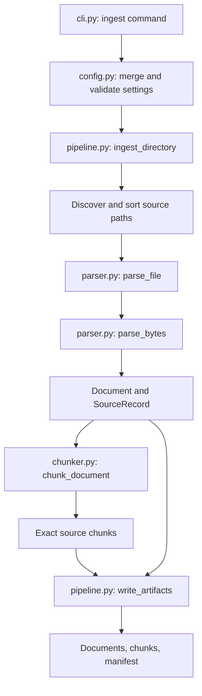

# M2: understanding document ingestion and chunking

M2 turns local source files into documents and chunks that later retrieval strategies can share. It preserves enough provenance to trace a chunk back to the original file. It does not extract entities, construct a graph, create embeddings, or answer questions.

## 1. Why this stage matters to the experiment

A retriever ranks the chunks we give it. If a relevant fact is cut in half, silently removed during cleaning, or assigned the wrong source coordinates, later retrieval scores become difficult to interpret. Different chunks for graph and vector retrieval would also introduce a confounding variable.

Our initial guarantees are therefore structural: exact source slices, bounded size, deterministic ordering, stable identities, and explicit settings. These guarantees do not establish that these chunk sizes are optimal. Chunk size and overlap remain experimental parameters.

## 2. Run the examples

After the installation commands in the root README, run this from the repository:

```bash
.venv/bin/python scripts/study_m2.py
```

This executable walkthrough prints the examples in sections 5 and 6 below. It does not write files. Its output is checked by `test_study_script_demonstrates_the_documented_offsets`.

To process actual example files:

```bash
.venv/bin/graphrag-bench ingest datasets/examples/ingestion \
  --config configs/ingestion.toml \
  --output datasets/processed/m2-example
```

Expected summary:

```json
{"chunks": 4, "documents": 2, "ignored_files": 0, "output": "datasets/processed/m2-example", "status": "ingested"}
```

The output directory must not already exist. On another run, choose a fresh name, such as `datasets/processed/m2-example-2`. Outputs are ignored by Git. The command never overwrites an existing directory, including an empty one.

The three output files are:

| File | Contents | Why it exists |
| --- | --- | --- |
| `documents.jsonl` | One validated `Document` per source file | Stores the exact text against which all offsets are defined |
| `chunks.jsonl` | Ordered `Chunk` records | Gives every later retriever the same candidate evidence |
| `manifest.json` | Configuration, versions, source metadata, counts, output hashes | Records how the artifacts were produced and lets us detect changed bytes |

JSONL means one complete JSON object per physical line. Newlines inside document text are escaped in JSON; decoding restores them. The manifest is one JSON object. Use an editor's JSON formatter or `python -m json.tool` to inspect it without changing the stored file.

## 3. Follow the code



Read the public functions first. Then follow their small helpers in this order:

1. `parse_bytes`: decoding, checksums, document identity, and source metadata.
2. `_headings` and `_sections`: a limited Markdown structure detector.
3. `chunk_document`: validates section ranges and coordinates the splitting steps.
4. `_paragraphs`, `_sentences`, `_split_long`, `_windows`: the actual chunking algorithm.
5. `ingest_directory` and `write_artifacts`: batch ordering and artifact serialization.

`ParsedDocument` is an internal dataclass containing a `Document` and its `SourceRecord`. The latter contains the relative source path, input format, raw byte checksum, byte count, BOM flag, and section ranges. Existing M1 document and chunk schemas remain unchanged.

## 4. Parsing and conservative cleaning

Supported extensions are `.txt`, `.md`, and `.markdown`, matched without case sensitivity. Input must be UTF-8. An optional initial UTF-8 byte order mark (BOM) is removed. No other text transformation occurs.

We preserve CRLF and LF line endings, indentation, repeated spaces, Markdown syntax, formulas, casing, and Unicode representation. We do not normalize whitespace, dehyphenate wrapped words, remove references, render Markdown, or guess a PDF reading order. Those operations could alter meaning or move evidence offsets; introducing them later requires explicit mapping and tests.

Empty or whitespace-only documents, invalid UTF-8, and NUL-containing text fail with a contextual error. Other file extensions are ignored and listed in the manifest. Hidden files are ignored; hidden directories and symlinked directories are not traversed. A symlinked source file with a supported extension is rejected. Directory traversal errors also fail the run.

For Markdown, the parser recognizes ATX headings with one to six `#` characters, with up to three leading spaces. Parent headings appear in labels such as `Paper / Method / Detail`. Top-level backtick and tilde fences prevent apparent headings inside code from becoming sections. The first H1 supplies the document title; otherwise the filename stem is used. Text files use the filename stem and one unnamed section.

This is a structural subset, not a complete CommonMark parser. Setext headings, container/nested Markdown rules, HTML block behavior, and rendering semantics are not implemented. The [CommonMark specification](https://spec.commonmark.org/0.31.2/#atx-headings) is the reference for the recognized heading convention, not a claim of full conformance.

Sections partition the stored document exactly. A section includes its heading text. A preamble before the first heading gets an unnamed section. Headings remain retrievable text: a heading separated from its body by a blank line can become a small chunk. This favors inspectable coverage in v1, but could introduce low-information candidates; filtering or attaching headings later would be a separate, measured change. Text and Markdown have no reliable page numbers, so `Chunk.page` remains `None`.

## 5. How chunking works

For each section:

1. Split into paragraphs at blank lines. A single wrapped newline stays inside its paragraph.
2. Detect sentence endings using `.`, `!`, and `?` followed by whitespace or the end of the paragraph. Closing quotes/brackets can follow the punctuation. A small abbreviation list and an initial/initialism rule suppress some false boundaries. Decimal points inside numbers are not endings.
3. If a sentence exceeds `max_chars`, split it at the last available whitespace within the limit. If no whitespace is available, cut at a Unicode character boundary. Each resulting fragment is a unit; ordinary sentences are also units.
4. Greedily pack consecutive units, respecting both `max_chars` and `max_units`.
5. Carry up to `overlap_units` units into the next window. Reduce that overlap if it would prevent the next window from including new text. Stop after the last new unit, without emitting an overlap-only tail.

Chunks never cross paragraph or section boundaries. Overlap resets at each boundary. Leading and trailing whitespace are omitted by moving the chunk's offsets inward. Internal whitespace is preserved. Every non-whitespace character in the stored document remains covered by at least one chunk, including Markdown syntax and headings.

The sentence detector is a transparent heuristic. It can over-merge after abbreviations and under-segment unusual punctuation, citations, URLs, and languages using other sentence marks. Long sentences, code, and tables can be split into fragments. These are explicit limitations; a linguistic tokenizer or semantic chunker can be evaluated later.

### Worked overlap example

Text: `Alpha. Beta. Gamma. Delta.`

Settings: `max_chars=40`, `max_units=2`, `overlap_units=1`.

| Ordinal | Character range | Exact chunk text |
| --- | --- | --- |
| 0 | `[0, 12)` | `Alpha. Beta.` |
| 1 | `[7, 19)` | `Beta. Gamma.` |
| 2 | `[13, 26)` | `Gamma. Delta.` |

Beta appears in the first two windows. Gamma appears in the last two. There is no fourth chunk containing only Delta, because it would add no new evidence.

The stored text is always exactly `document.text[chunk.start:chunk.end]`. We never create a chunk by joining sentence strings with invented spaces.

If `max_chars` becomes 12 and `max_units=3`, `overlap_units=2`, the windows become `Alpha. Beta.`, `Beta. Gamma.`, and `Delta.`. Keeping Gamma before Delta would create 13 characters, exceeding the hard limit. Requested overlap is therefore an upper bound, not a guarantee.

## 6. Character offsets versus byte offsets

Offsets count Python string characters, meaning Unicode code points. They are not UTF-8 byte positions, tokenizer positions, or user-perceived grapheme clusters. A forced cut can separate combining characters even though the original code points remain recoverable.

The second executable example starts with a UTF-8 BOM followed by `α.\r\nBeta.`. The original file has 13 bytes; stored text has 9 characters.

| Chunk text | Stored character range | Original byte range |
| --- | --- | --- |
| `α.` | `[0, 2)` | `[3, 6)` |
| `Beta.` | `[4, 9)` | `[8, 13)` |

The BOM occupies three bytes. Alpha occupies two UTF-8 bytes but one character. CRLF occupies two characters and remains in the stored document even though neither chunk contains the separator.

Because BOM removal is the only transformation, a character boundary `i` maps back to the original bytes as:

```python
byte_offset = bom_byte_count + len(document.text[:i].encode("utf-8"))
```

The script checks that decoding each original byte slice returns exactly the chunk text. This prefix calculation is a teaching example; repeated mapping across large documents would benefit from an offset index.

## 7. Configuration and tradeoffs

| Setting | Default | Meaning | Tradeoff |
| --- | --- | --- | --- |
| `max_chars` | 800 | Hard limit on the complete stored chunk slice | Smaller chunks may fragment facts; larger chunks can dilute retrieval matches |
| `max_units` | 5 | Maximum sentences/fragments per window | Bounds the number of semantic units even when sentences are short |
| `overlap_units` | 1 | Maximum repeated units within a paragraph | Can preserve context near boundaries, but increases duplicate evidence and index size |

These defaults are starting points, not tuned findings. `max_chars` is **not a model token limit**. M4 must check actual tokenizer lengths and avoid silent embedding truncation. The planned 2,000-token retrieval context budget is a separate later constraint.

Settings come from defaults, then an optional TOML `[chunking]` table, then explicit CLI flags. The final combined values are validated. Unknown tables or fields, non-integer values, non-positive limits, negative overlap, and `overlap_units >= max_units` are rejected. TOML parsing uses Python's built-in [tomllib](https://docs.python.org/3/library/tomllib.html).

For one sentence per chunk, use `configs/sentence-fixture.toml`, or pass both `--max-units 1 --overlap-units 0`. Oversized sentences still require fragments. On the two-file Markdown/text example this configuration produces seven chunks, because heading text remains included in the relevant units.

## 8. Identity and reproducibility

Document IDs hash the parser version, corpus-relative path, and checksum of the canonical document text. Moving the whole corpus to another absolute directory preserves IDs. Renaming a file or changing its text changes its ID. Two files with identical text but different paths remain separate documents; they share a content checksum that future deduplication can use. Adding/removing only a BOM preserves the document ID but changes the raw source checksum.

Chunk IDs hash document identity, document content checksum, chunker version, a fingerprint of all chunking settings, character bounds, and section label. Configuration changes intentionally invalidate chunk IDs, even if a particular chunk's text happens to remain the same. This prevents silently mixing chunks from different experimental configurations.

Exports use sorted source paths, sorted JSON keys, UTF-8, and explicit LF record separators. They exclude timestamps, absolute paths, and machine-specific timing. With the same relative source files, configuration, and implementation versions, exports are byte-identical after relocating the corpus. The manifest retains parser/chunker/package versions and output hashes; an experiment-level `RunManifest` will later record runtime context and the Git commit.

All sources are parsed before output creation. Existing output directories are refused. The manifest is written last; an I/O failure can leave a partial new output directory. Consumers must require a valid, complete manifest and verify its hashes, not merely check for a directory or filename. M3 adds `load_ingestion` in `ingestion/reader.py`, which checks artifact hashes, counts, source references, chunk coordinates, and section partitions before graph construction.

## 9. What the tests prove

| Test file or example | Guarantee checked |
| --- | --- |
| `test_parser.py` | UTF-8/BOM behavior, CRLF preservation, hashes, path identity, heading/fence handling, invalid input errors |
| `test_config.py` | Valid settings, errors, and merge precedence |
| `test_chunker.py` overlap examples | Exact expected offsets, reduced overlap, no redundant tail |
| `test_chunk_invariants_across_boundaries` | Hard size limits, source slices, increasing spans, unique IDs, complete non-whitespace coverage over several settings |
| `test_sentence_configuration_reproduces_all_m1_reference_spans` | All 25 M1 manually specified reference spans are reproduced |
| `test_ingestion.py` | All eight fixture sources pass through parsing and chunking; deterministic exports after relocation, source ordering, checksums, output protection, error behavior, example output |
| `test_cli.py` ingestion cases | Configuration overrides and ingestion without calling the gold fixture loader |
| `test_study_script_demonstrates_the_documented_offsets` | The teaching script runs and prints the documented examples |

M1 reference chunk IDs and their manually assigned `Overview` labels are fixture annotations. The reproduction test compares document IDs, ordinal, start/end, and text; it does not pretend those manual IDs or labels were inferred from source text. Future extractors must cite the actual generated chunk IDs.

Tests establish behavior on specified cases, not perfect sentence segmentation or retrieval quality. The fixture corpus remains a correctness fixture. No benchmark metric is computed by M2.

## 10. Questions to answer before M3

1. Why must a chunk be a document slice rather than a concatenation of cleaned sentences?
2. Why are document hashes and raw-file hashes both necessary?
3. Why can overlap increase index size without increasing unique evidence coverage?
4. Which settings can change chunk IDs without changing document IDs?
5. Why can two-document questions still require only one reasoning hop?
6. What information would a PDF parser need to add before we could trust page citations?

Answer check: exact slices preserve auditable coordinates; raw hashes identify bytes while text hashes identify canonical text; repeated units are duplicate evidence; any chunking setting changes chunk IDs; comparing independent direct facts is not a sequential join; PDF parsing needs reading-order validation and a mapping from stored text spans to source pages/layout.

M3 now consumes these generated chunks for deterministic extraction and graph construction. It preserves their provenance and keeps benchmark labels out of extraction inputs. Continue with the [M3 walkthrough](extraction-and-graph.md). M2's unit is a sentence window; M3's restricted grammar expects a complete statement on one source line and inside one chunk. Wrapped or fragmented statements may therefore be skipped and reported by M3 even though M2 ingested them correctly.
