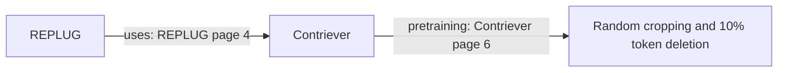

# M10 expansion: a larger library and a reviewable exam

The library now contains **30 real research papers, 558 PDF pages, and 6,996 chunks**. The exam contains **40 draft development questions**, including five candidate two-hop chains. Every paper supplies at least one annotated passage. These are preparation results, not retrieval scores.

The [three-paper lesson](real-paper-corpus.md) explains the original pipeline. This chapter explains the expansion and what you can honestly say in an interview. The [data card](../datasets/papers/research/README.md) records selection and licensing; the [observation report](../reports/m10-expansion.md) records measured checks.

## Think of the Scouts' library

We previously tested the Scouts with short, fictional reports whose answers we already knew. We then tried three real research papers. Now we have a larger library of real papers with messy typography, references, tables, and repeated explanations.

Thirty papers does not mean thirty models were installed. They are documents for our own search system to read. The existing embedding model and local language model remain separate components. This step downloaded papers, not model weights, and did not call paid APIs.

Keep three things separate:

| Thing | Scout analogy | Actual artifact |
| --- | --- | --- |
| Corpus | The library the Scouts may search | `ingestion/documents.jsonl` and `chunks.jsonl` |
| Development questions | Practice exam, visible while improving the system | `questions.jsonl`, all `split=dev` |
| Independent review | Someone else checks the answer sheet | A separate reviewer decision file |

There is no held-out exam yet. A practice question does not become unseen just because we rename it `test`.

## A real bridge question

Remember: Eren belongs to Lantern Squad; Lantern Squad guards the east gate. Lantern Squad connects the two reports.

Question `paper-b02` asks about the original pretraining of REPLUG's retriever without naming that retriever in the question:



First, read [REPLUG page 4](https://arxiv.org/pdf/2301.12652v4#page=4) to identify Contriever. Then read [Contriever page 6](https://arxiv.org/pdf/2112.09118v4#page=6) for the requested training details. Random cropping takes shorter sections of a document; token deletion removes some text units during training. These descriptions concern the authors' method. We did not train Contriever ourselves.

This is a **candidate** two-hop question. Our selected evidence follows two successive relationships, but another paper could state the entire connection. An independent reviewer must search for that shortcut before accepting the hop and minimum-document labels.

We found precisely this problem with a different proposed question: REPLUG's paper already explains its retriever's mean pooling on page 3. Asking for pooling would not require the second paper. We rejected that bridge idea and recorded why. Adding two citations is not proof of two-hop reasoning.

The five candidates cover RAPTOR → SBERT, REPLUG → Contriever, Self-RAG → Contriever, NV-Embed → Mistral, and E5-mistral → Mistral. They ask about the original referenced methods. For example, NV-Embed changes its backbone's attention; a question about original Mistral caching must not imply that NV-Embed retains that cache design.

## Why smaller chunks helped, but are not always better

A chunk is a passage the Scout can carry. The embedding model accepts at most 384 tokens, counting its special tokens. All 600-character chunks passed that limit, but the source-coverage audit found another issue.

An INSTRUCTOR quotation crossed a hard chunk boundary. One chunk ended at character 600; the next started at 601. The omitted character was a space. Our evidence metric checks exact continuous character coverage, so it correctly reported that the selected representation could not cover the complete quotation—even when given every chunk.

We checked three configurations on development data:

| Maximum characters | Chunks | Largest encoded chunk | Uncoverable dev questions |
| ---: | ---: | ---: | --- |
| 600 | 6,136 | 367 tokens | `paper-d04` |
| 512 | 6,996 | 318 tokens | None |
| 400 | 8,575 | 251 tokens | `paper-d10` |

The research configuration uses 512 characters, five units per window, and one overlapping unit. We selected it using the encoder constraint and known development-evidence coverage, before retrieval comparisons. This is a development-informed configuration choice. We did not change the quotes or weaken the evidence metric to obtain coverage. The original pilot keeps its 600-character configuration.

The general limitation remains: sentence splitting is a heuristic, and a hard cut can omit boundary whitespace. A new corpus or annotation revision needs a new audit. Smaller chunks do not monotonically improve evidence coverage. A future chunker change would need its own version and regenerated artifacts.

## What the PDF warnings mean

The parser pins `pypdf==6.19.0` and preserves its plain extracted text, including awkward spaces and hyphenation. Some papers produce warnings about optional `fontTools` support for CFF fonts. In Nomic, for example, extracted words may contain spaces that are absent in the rendered PDF. Formula extraction can also be imperfect. The chosen prose quotations were checked against source text; selected pages were visually inspected as recorded in the report.

Installing an optional font decoder can change extracted characters and therefore every later evidence coordinate. The existing `plain-pages-v1` recipe now explicitly rejects environments containing `fontTools`. Use a separate PDF-parsing environment if another tool needs it. Better font decoding would require a new parser recipe and regenerated, reviewed labels. Ordinary saved-bundle verification does not import pypdf or require that parsing environment.

## Prepare and inspect the expanded corpus

Run from the repository root. The optional `papers` dependency and cached M4 model are already installed on this workspace. A fresh installation can use `pip install -e '.[papers]'` in a virtual environment without `fontTools`.

```bash
.venv/bin/graphrag-bench fetch-papers \
  --catalog datasets/papers/research/catalog.json \
  --output datasets/raw/m10-expanded
.venv/bin/graphrag-bench prepare-papers \
  --catalog datasets/papers/research/catalog.json \
  --annotations datasets/papers/research/annotations.json \
  --raw datasets/raw/m10-expanded --config configs/papers-research.toml \
  --output datasets/processed/my-research-corpus
.venv/bin/graphrag-bench verify-papers datasets/processed/my-research-corpus \
  --raw datasets/raw/m10-expanded
.venv/bin/graphrag-bench audit-papers datasets/processed/my-research-corpus
.venv/bin/python scripts/study_m10_expansion.py \
  --bundle datasets/processed/my-research-corpus
```

Only `fetch-papers` contacts arXiv; the complete pinned corpus is 43,300,527 bytes. Valid cached PDFs are reused. Use a fresh prepared-output directory on every build. The existing local final bundle is `datasets/processed/m10-expanded-03`; you can audit or study it directly without rebuilding.

`all_source_evidence_coverable=true` means the complete chunk collection can represent the selected facts. It does not mean a retriever actually finds them. Giving the evaluator all chunks removes the search problem entirely.

To reproduce the token preflight on an already verified bundle, use the cached tokenizer only:

```bash
HF_HUB_OFFLINE=1 .venv/bin/python - <<'PY'
import json
from pathlib import Path
from transformers import AutoTokenizer
chunks = [json.loads(line) for line in Path(
    'datasets/processed/m10-expanded-03/ingestion/chunks.jsonl'
).read_text().splitlines()]
tokenizer = AutoTokenizer.from_pretrained(
    'sentence-transformers/msmarco-MiniLM-L6-cos-v5',
    revision='14ca9be4bbcf1402eac0f43a2e2ccb6e0f994ba3',
    local_files_only=True,
)
lengths = [len(ids) for ids in tokenizer(
    [c['text'] for c in chunks], add_special_tokens=True,
    truncation=False, padding=False,
)['input_ids']]
print({'chunks': len(lengths), 'max_tokens': max(lengths),
       'over_limit': sum(n > 384 for n in lengths)})
PY
```

The pinned embedding configuration has empty document/query prefixes. Other model prefixes also consume capacity; do not reuse these counts for another model or corpus.

## Have someone independently review the answer sheet

The authoring agent cannot independently approve its own work. A reviewer should understand the papers and have had no role in writing the annotations. Familiarizing yourself with this public development set is fine; it prevents treating it as unseen evaluation data later.

```bash
.venv/bin/graphrag-bench export-paper-review datasets/processed/m10-expanded-03 \
  --output experiments/runs/my-independent-review.json
.venv/bin/graphrag-bench verify-paper-review datasets/processed/m10-expanded-03 \
  --review experiments/runs/my-independent-review.json
```

Export creates **pending rows only** and refuses to overwrite a file. The prepared `review.md` contains the question, answer, exact quotes, page links, and rationale. The JSON decision file is separate. An existing unfilled sheet is `experiments/runs/m10-expanded-review-v2.json`.

Review one question at a time:

1. Read the rendered source pages and surrounding sections. Check whether a sentence describes the paper's own method, a baseline, or earlier work.
2. Check every claim in the reference answer and whether all necessary facts appear in the selected evidence.
3. Search the full corpus for alternative sufficient passages and one-document shortcuts. Record where you looked and what you found.
4. Check the minimum document count and reasoning hops separately. Record ambiguity, unsupported claims, or corrections.
5. Record your name/identifier, review date, decision, and specific notes in that question's JSON row.

An `approved` row requires `reviewer`, `reviewed_on` in `YYYY-MM-DD` form, nonblank `notes`, an explicit `independent_of_annotation_author: true`, and all six checks set to the JSON boolean `true`:

| JSON check | The reviewer confirms |
| --- | --- |
| `source_checked` | Rendered pages and surrounding context were inspected |
| `answer_supported` | The quoted material supports the answer's claims |
| `evidence_complete` | No necessary supporting fact is missing |
| `alternatives_checked` | Plausible alternatives and shortcuts were investigated |
| `document_count_checked` | The proposed minimum document requirement is defensible |
| `reasoning_hops_checked` | Successive reasoning relations justify the hop label |

Use `revise` when something needs changing. It requires reviewer, date, and notes but permits false or unfilled checks. Keep unfinished rows `pending`, with reviewer/date null, independence false, and checks null; interim observations can go in `notes`. Do not fill checks through a script that has not actually performed the review.

Verification checks file structure, exact question inventory, and the fingerprint of the bundle's manifest. It cannot authenticate a person or prove independence. Exit code 0 means **valid records**, including valid pending or revision records; inspect the counts and `all_questions_approved`. The output explicitly reports `reviewer_identity_authenticated=false`.

A correction means editing the tracked source annotations, preparing a new bundle in a fresh directory, and exporting a new review sheet. The old sheet stays as the audit trail for the old bundle. Its approvals do not transfer automatically. A different bundle fingerprint is rejected as stale. The source bundle remains an immutable record of originally pending, agent-authored development annotations, even when a separate review sheet later records approvals. Approval never changes `dev` to `test`.

## What remains before research claims

The original plan is approximately 30 papers and 120 reviewed questions: 40 development and 80 held out. Both sets now exist: the 40 **draft** dev questions here, and [80 results-blinded held-out questions](held-out-questions.md) that have been run once. Independent human review of either set largely remains; 11 dev questions and 10 held-out questions carry a recorded owner decision. Related chains/templates must stay together; the current 23 grouping labels are organizational aids, not proof of statistical independence or a certified split plan. Five bridge candidates do not meet the planned 40 held-out two-hop cases.

M11 still needs to connect model-extracted graphs to the comparative runner and measure retrieval/answer failures under frozen settings. The existing benchmark runner uses the deterministic rule extractor internally; pointing it at these papers is not the intended LLM-graph study. No comparative M11 run or full-corpus model extraction occurred in this expansion.

An interview explanation you can defend:

> I expanded a reproducible PDF corpus to 30 research papers and created 40 source-linked development questions. Each reference fact has a physical page and exact character coordinates. I added audits that exposed a chunk-boundary coverage problem, and review records that detect stale approvals after data changes. I documented selection bias and potential reasoning shortcuts. Independent review and held-out experiments are still pending, so I do not claim that graph retrieval outperforms vector retrieval.

Run the short lesson without any downloaded corpus using `.venv/bin/python scripts/study_m10_expansion.py`. Then answer: Why can a quotation be exact but misleading? Why does a second source sometimes fail to make a question two-hop? Why is a human name in JSON not identity authentication? Why can all-source coverage be perfect while actual retrieval is poor?
