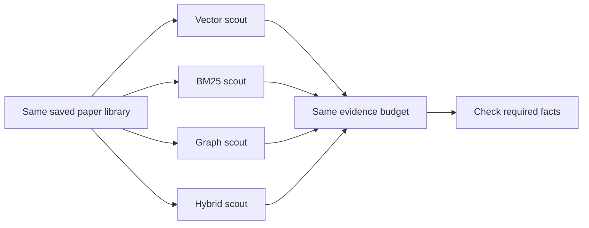

# M11: putting the scouts through the same exam

This lesson explains the implemented real-paper comparison runner. The full
four-method research study is **not complete**. We have 40 draft development
questions, zero held-out questions, and no independently reviewed annotations.
See the [measured development report](../reports/m11-development.md) for what
actually ran. Software capability and experimental evidence are different things.

## 1. The mission

Imagine four scouts searching the same library of reports:

| Scout | How the scout searches |
| --- | --- |
| BM25 | Looks for the question's words, emphasizing useful, less common words. |
| Vector | Compares numerical representations of the question and passages. |
| Graph | Follows named entities and their recorded relationships. |
| Hybrid | Combines the vector and graph rankings. |

We want to measure which scout brings back the evidence needed to answer. We do
not ask the writer to compose an answer during this experiment. A fluent writer
could hide missing evidence or invent a convincing answer, making retrieval
quality harder to study.



The runner supports all four paths. The completed real-paper baseline used only
vector and BM25; graph and hybrid still need the complete paper graph.

Think back to our fictional reports:

> Report A: Eren belongs to Lantern Squad.
> Report B: Lantern Squad guards the east gate.

For “Which gate does Eren's squad guard?”, A alone is incomplete. B alone is also
incomplete. A and B together connect Eren to the east gate. That is the distinction
between retrieving something relevant and retrieving sufficient evidence.

**Pause:** What does the name “Lantern Squad” do here? It joins the two facts.

## 2. Everyone needs the same library

The earlier M7 benchmark built its own chunks and rule-extracted graph. That was
appropriate for controlled fictional fixtures. Applying it unchanged to the paper
bundle would create different chunks from those used by the saved page-aware
vector index and model-extracted graph.

M11 therefore adds `benchmark-papers`. It verifies and reuses three frozen inputs:

1. The M10 paper bundle: canonical text, page-aware chunks, and separate dev labels.
2. An embedding index built from that exact ingestion bundle.
3. A complete LLM graph from the same ingestion, when graph or hybrid is selected.

“Frozen” means the comparison does not change or rebuild those inputs. Chunk
settings must agree exactly. Every index row must correspond to the saved source.
The graph loader replays recorded model proposals and source checks, and requires
a response for **every** source chunk. A graph extracted from only eight chunks
cannot be passed off as the full 6,996-chunk graph.

The baseline configuration selects vector and BM25 only. It does not produce
graph or hybrid scores. Both still use the embedding model's tokenizer for the
same evidence budget. This is why even the BM25 baseline command needs the saved
embedding specification and cached tokenizer.

## 3. Same exam rules

Both provided configurations use K=5 and K=10, a 2,000-token context budget, three
repeats, and seed 0. The full configuration includes all four methods. The
baseline configuration includes two. The runner:

1. Gives the retriever only the query text and requested result count.
2. Retrieves the largest K once, then evaluates shorter ranking prefixes.
3. Removes duplicate source intervals and assembles whole uncovered passages.
4. Counts the rendered context with the same tokenizer for each method.
5. Skips a passage if adding it would exceed the budget; it does not truncate it.
6. Scores exact annotated source coverage before and after budget selection.

Reference answers and annotated facts are used for scoring, never for extracting
the graph, creating embeddings, or constructing retrievers. The production runner
has a dataset object for evaluation; the search components receive only source
artifacts and settings. Tests remove the question collection and confirm that
the same query returns the same ranked hits.

## 4. Read the scoreboard carefully

**Complete evidence:** did the selected passages cover every required span in at
least one sufficient evidence set? In the Eren example, both facts must be covered.

**Evidence coverage:** what fraction of the required facts were fully covered in
the best-covered sufficient set? Covering one of the two Eren facts earns 50%.
Covering half of a fact's required quotation earns no credit for that fact. This
measures partial progress across facts, not character overlap or the probability
that a generated answer would be correct.

**Raw versus budgeted:** raw scores use the top K chunks. Budgeted scores use the
actual deduplicated passages that fit into the shared context allowance. The second
view reflects what a downstream writer could actually receive.

**Three repeats:** rerunning the same question helps check deterministic rankings
and measure runtime variation. It does not create three independent questions.
Questions sharing a group may also be correlated. The report records groups and
does not claim statistical significance or supply confidence intervals.

**Warm latency:** one initial query per strategy is excluded as a warmup. Timed
retrieval includes query embedding when that method uses it, graph traversal,
ranking, and fusion as applicable. Context assembly is timed separately. Model
loading, artifact verification, index construction, and graph extraction are not
part of warm retrieval latency. A fast search can still require expensive setup.

## 5. A sealed experiment folder

Every run saves copies of its paper bundle, vector index, and optional LLM graph.
It also saves `results.jsonl`, `summary.json`, `report.md`, and an outer manifest
with configurations, code provenance, source-manifest hashes, and artifact hashes.
Outputs must be new directories outside the input directories.

`verify-paper-benchmark` works without the original folders, raw PDFs, model
weights, or network. It verifies input artifacts, replays graph validation where
applicable, checks the complete question/strategy/repeat inventory, reconstructs
selected source pieces from recorded budget decisions, recomputes evidence scores,
and regenerates the summary and report.

It **does not** rerun neural rankings, retokenize context, remeasure time, or prove
that the original PDF was extracted perfectly. Token counts and budget decisions
remain recorded observations. Hashes detect changed bytes relative to the manifest;
they are not signed proof of authorship. Source-aligned graph quotations still
need semantic review.

## 6. Reproduce the local development baseline

These commands assume the existing M10 expanded bundle and approved models are
already cached. They perform no model downloads. Choose fresh output paths.

```bash
.venv/bin/graphrag-bench index-vector datasets/processed/m10-expanded-03/ingestion \
  --config configs/embedding.toml \
  --output experiments/runs/m11-research-vectors
.venv/bin/graphrag-bench benchmark-papers datasets/processed/m10-expanded-03 \
  --index experiments/runs/m11-research-vectors \
  --config configs/benchmark-papers-baseline.toml \
  --output experiments/runs/m11-research-baseline
.venv/bin/graphrag-bench verify-paper-benchmark \
  experiments/runs/m11-research-baseline
```

For a full four-method dev comparison, first produce the complete graph using
`build-llm-graph`, then pass it with `--graph` and select
`configs/benchmark-papers.toml`. Do not launch full extraction without reading the
measured runtime report. Once a complete graph exists, the command is:

```bash
.venv/bin/graphrag-bench benchmark-papers datasets/processed/m10-expanded-03 \
  --index experiments/runs/m11-research-vectors \
  --graph experiments/runs/m11-research-graph \
  --config configs/benchmark-papers.toml \
  --output experiments/runs/m11-research-comparison
```

That last command is a future run recipe, not a claim that its graph exists.

## 7. Why sample extraction cost first?

Before sending thousands of chunks through the small local language model, measure
a few. `scripts/preflight_paper_extraction.py` chooses eight evenly spaced source
chunks after sorting by document ID and ordinal. It does not read benchmark labels.
It records tokens, finish reasons, response-schema validity, pinned model settings,
source hashes, and times. Its cache receipts can be reused by full extraction.
It also replays the existing source/type/quotation checks on the sampled receipts.
Sample validation keeps the full corpus coordinates but returns only diagnostic
results. It cannot satisfy a complete graph's all-chunk inventory requirement.

```bash
.venv/bin/python scripts/preflight_paper_extraction.py \
  datasets/processed/m10-expanded-03/ingestion \
  --config configs/llm-extraction.toml \
  --response-cache experiments/runs/m11-research-extraction-cache
```

Multiplying average sample time by 6,996 is a rough planning estimate, not a
representative runtime study. Reference sections and first pages can behave very
differently. A response ending at the output limit is rejected by graph extraction.
A schema-valid response can still contain missing names, invalid relationships,
or unsupported claims. The preflight produces no graph and no retrieval scores.

### The bounded local extractor experiment

The original small model copied fictional example names into unrelated papers.
Two opt-in prompt profiles let us test that failure without changing the default:

- `compact-v1` removes examples and requests fewer outputs. Its first prototype
  copied ontology definitions instead. Making a prompt shorter did not solve the task.
- `focused-v1` puts the schema and ontology in the system message. Each user message
  then contains only its source passage, matching the shape of the fictional examples.
  A fourth example demonstrates an empty result for a passage without named facts.

The focused configuration requests at most four entities and one relation and
limits generation to 320 tokens. These requested counts are prompt instructions;
they are not additional parser guarantees. The output-token limit is enforced.
The exact same named-entity, endpoint-type, and source-quote checks still apply.

An optional `strip_entity_whitespace` setting repairs only leading/trailing
whitespace in an entity name. For example, `" Harbor"` becomes `"Harbor"` before
checking that Harbor exists exactly in the source and relation quote. `"Har bor"`
and an invented name remain invalid. The original model output stays in its receipt,
and a `normalized_entity` diagnostic records the repair. The setting is off in
the original recipe and included in the fingerprint when enabled.

Prompt definitions are rendered in a stable order so saving and reloading a
configuration does not change the prompt. Regression tests preserve the old M8
recipe fingerprint. An existing M8 graph and the final focused control graph both
replay under the updated code.

In three known fictional controls, the final focused recipe with normalization
retains the two correct relations and returns no relation for the negated one.
That is a narrow, observed improvement in handling this control example. It does
not establish real-paper extraction quality. The [development report](../reports/m11-development.md)
records the real-paper failures, including unsuccessful prompt candidates.

To inspect this candidate locally, choose fresh output paths:

```bash
.venv/bin/python scripts/preflight_paper_extraction.py \
  datasets/processed/m10-expanded-03/ingestion \
  --config configs/llm-extraction-focused.toml \
  --response-cache experiments/runs/m11-research-extraction-cache
.venv/bin/graphrag-bench build-llm-graph datasets/processed/m8-local-input \
  --config configs/llm-extraction-focused.toml \
  --response-cache experiments/runs/m11-research-extraction-cache \
  --output experiments/runs/m11-focused-controls-new
```

The second command uses the three **fictional** M8 source passages as controls.
Its small graph is not a graph of the 30-paper research corpus.

## 8. What is still missing?

The complete real-paper model graph, full four-method comparison, independent
annotation review, and genuinely held-out evaluation remain required. Development
scores can guide engineering, but looking at them makes them unsuitable as unseen
test results. The planned 80 held-out questions need a separate review and split
process; relabeling these 40 known questions would not make them held out.

The next decision concerns extraction feasibility and quality. After completing
the comparison, M12 can examine ablations and failure categories. We have not
started M12 or established that hybrid retrieval is superior.

## Interview version

> I built a comparison runner that binds real-paper chunks, embeddings, and a
> model-extracted graph to the same verified source. It uses identical context
> budgets and scores evidence separately from answer generation. Runs include
> frozen inputs and offline source-metric verification. I distinguish development
> diagnostics from held-out results and measure extraction cost before scaling.

**Check your understanding:** Why would a graph built from only a few pages be an
unfair comparison against a vector index covering the whole library? The methods
would have different searchable evidence, so a score difference would mix source
coverage with retrieval ability.
