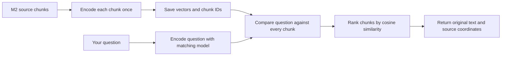

# M4: find source chunks with vector retrieval

M4 implements the vector baseline from the experiment design: a local Sentence Transformers encoder, saved chunk embeddings, and exact NumPy cosine search. It also adds the planned small BM25 lexical sanity baseline. Both return source chunks through the existing `RetrievalResult` contract. Neither writes an answer or follows graph edges.

## 1. The beginner explanation

Imagine our documents are a box of numbered cards. M2 made those cards and recorded where each came from. M3 drew a map connecting named things on them. M4 adds a different way to find useful cards: describe the topic of every card with a list of numbers, describe your question the same way, and compare the lists.

That list of numbers is an **embedding**, also called a **vector**. A pretrained model calculates it from text. The model has already learned patterns from other text before our project uses it. We are not training it here. Its numbers are learned features; coordinate 17 does not have a dependable human label such as “datasets.”

The question and every chunk must use the same compatible model and settings. Using two unrelated models would be like comparing coordinates from different maps. Equal list lengths alone do not make those maps compatible.

**Retrieval** means finding and ranking source material. **Generation** means writing an answer from that material. M4 retrieves. If it returns the sentence about Birch and Cedar, you can read the sentence yourself, but the system has not yet generated or verified an answer.



“Every chunk” is intentional. Our corpus is small enough to check all stored vectors. This gives us a clear baseline without an approximate index potentially missing a neighbor.

## 2. What cosine similarity measures

First use two-number vectors that we chose by hand. They demonstrate arithmetic only; they are not real text embeddings.

| Vector | Length | Unit vector | Similarity to `[1, 0]` |
| --- | --- | --- | --- |
| `[3, 4]` | 5 | `[0.6, 0.8]` | 0.6 |
| `[0, 5]` | 5 | `[0, 1]` | 0.0 |
| `[6, 8]` | 10 | `[0.6, 0.8]` | 0.6 |

Length comes from `sqrt(x₁² + x₂² + …)`. Dividing each number by that length is **normalization**. It makes the vector's length equal to one. `[3, 4]` and `[6, 8]` point in the same direction even though one is longer, so normalization gives them the same representation.

For two unit vectors, multiply matching coordinates and add the products:

```text
cosine([0.6, 0.8], [1, 0]) = 0.6 × 1 + 0.8 × 0 = 0.6
```

This is a **dot product**. It equals cosine similarity after normalization. Higher scores indicate more similar directions. Scores can range from −1 to 1. A score of 0.6 is not a 60% probability that the source answers the question.

The real model produces 384 coordinates, but the comparison uses the same operations. The [Sentence Transformers semantic-search documentation](https://www.sbert.net/examples/sentence_transformer/applications/semantic-search/README.html) describes this encode-and-compare approach and the difference between short-query/long-passage search and symmetric similarity.

## 3. Run the study script

The default demonstration needs the core dependencies only:

```bash
.venv/bin/python scripts/study_m4.py
```

It explains the arithmetic, then runs BM25 on generated chunks from the eight fixture source documents. BM25 searches words; it is not a substitute neural encoder. The script labels the two examples separately so that an offline arithmetic demonstration cannot be mistaken for semantic retrieval.

After the optional model setup below, run the real encoder:

```bash
.venv/bin/python scripts/study_m4.py --semantic
```

This generates 25 source chunks, embeds them into a `25 × 384` matrix, prints the top three results for two teaching questions, and checks that three runs of each query produce identical hits and scores in that process. It reads source documents, not gold questions or labels. The teaching questions are explicit example strings in the script; they are not a benchmark.

## 4. Install and cache the local model

The standard README installation is sufficient for M1–M3, the vector mathematics, BM25, and all unit tests. Neural embeddings are optional because their dependencies are much larger.

The tested CPU dependency lock targets **Linux x86_64 and Python 3.12**:

```bash
.venv/bin/python -m pip install -r requirements-dev.txt
.venv/bin/python -m pip install -r requirements-embeddings-cpu.txt
.venv/bin/python -m pip install --no-build-isolation -e .
```

The separate file pins the installed neural stack, including Sentence Transformers 6.1.0, Transformers 5.17.0, and CPU PyTorch 2.14.0. It uses PyTorch's official CPU wheel index. The project's portable optional dependency group is `.[embeddings]`; other platforms need a compatible PyTorch installation and dependency resolution rather than this Linux/Python 3.12 lock. Core CI still covers Python 3.11, 3.12, and 3.13 without neural downloads.

The configured model is [sentence-transformers/msmarco-MiniLM-L6-cos-v5](https://huggingface.co/sentence-transformers/msmarco-MiniLM-L6-cos-v5), a retrieval-trained English encoder with 384-dimensional outputs. Its model card describes training on MS MARCO query/passage pairs. We use the immutable revision:

```text
14ca9be4bbcf1402eac0f43a2e2ccb6e0f994ba3
```

Model weights are roughly 91 MB; the CPU PyTorch wheel used here is roughly 196 MB, with further supporting packages. They stay in the Python environment/model cache, not in Git. Inference runs locally and needs no paid API. Dependency/model downloads require internet access on first setup.

The provider defaults to **cached-only loading**. The first explicit model download can be made with:

```bash
.venv/bin/python scripts/study_m4.py --semantic --allow-download
```

After caching, omit `--allow-download`. CLI indexing and querying also accept it. `--cache-folder` on those commands selects a different cache directory; both commands must be able to find the same revision. Source text is processed locally rather than sent to an inference service. The adapter disables remote model code and requires safetensors weights.

## 5. Build and query a saved index

Use fresh output directories:

```bash
.venv/bin/graphrag-bench ingest datasets/examples/ingestion \
  --config configs/ingestion.toml \
  --output datasets/processed/m4-input
.venv/bin/graphrag-bench index-vector datasets/processed/m4-input \
  --config configs/embedding.toml \
  --output datasets/processed/m4-vector
.venv/bin/graphrag-bench query-vector datasets/processed/m4-vector \
  --source datasets/processed/m4-input \
  --query "Which model does Alder build on?" \
  --top-k 3
```

The two-file example yields **2 documents, 4 chunks**, and a saved **4 × 384** matrix. The default chunker includes Markdown heading chunks; M4 indexes every M2 chunk and does not silently remove headings. An existing M2 directory can also be indexed directly. Do not confuse this four-chunk example with the 25-chunk sentence configuration used by the study script.

The index command reports the chunk count, dimension, output directory, and `indexing_ms`. That timing includes provider initialization, embedding, construction, and export after the first source validation. It is not a pure neural-inference latency measurement.

The query command prints JSON containing:

- `result`: the query, strategy `vector`, ranked chunk IDs/scores, and retrieval time.
- `evidence`: the original chunk records in the same order, including text, document ID, start/end, and section/page metadata where known.
- `embedding`: the model, revision, dimensions, settings, and relevant library versions.

`--top-k 3` means “return at most three chunks.” Positive integers are required. If there are fewer chunks, all are returned. Equal scores use ascending chunk IDs to make the order stable. No similarity threshold or answerability detector is implemented: the nearest chunks are returned even for a question the corpus cannot answer. Negative similarity scores are valid.

Overlapping chunks and repeated text from different documents keep distinct IDs. M4 does not deduplicate them by text. Future shared context assembly and evidence evaluation must account for duplicate coverage.

## 6. The algorithm and code path

Read [scripts/study_m4.py](../scripts/study_m4.py) first, then follow this sequence:

1. `load_ingestion` verifies the original M2 artifact hashes, counts, references, and source slices. Gold annotations and graph files are not inputs.
2. `build_vector_index` creates a `CorpusIndex`, sorts chunks by `chunk_id`, and passes only their original text to `EmbeddingProvider.embed_documents`. It does not add inferred entity names, graph neighbors, question text, or source titles to the embeddings.
3. `SentenceTransformerProvider` loads the pinned CPU model, sets its maximum length, and uses the document encoding method. Query and document prefixes are explicit configuration; both are empty for this model. Provider imports are lazy, so core tests and BM25 do not require PyTorch.
4. Before encoding, the adapter counts tokens including prefixes and special tokens. Inputs beyond the configured limit are rejected. Actual encoding also disables text truncation. This adapter supports ordinary text encoders with a standard tokenizer; arbitrary multimodal, chat-template, or multi-tokenizer models are outside its supported scope.
5. `normalize_vectors` verifies shape and numeric values, converts to float32, computes norms in float64, rejects zero/nonfinite vectors, and produces unit vectors. Zero vectors have no direction and cannot define cosine similarity.
6. `VectorIndex` stores a defensive copy of the normalized matrix. Every row corresponds to one known chunk ID. Accessing `vectors` or `spec` returns a copy so callers cannot mutate the stored index accidentally.
7. For a query, validate nonblank text and positive `top_k`. Require exact equality between the query provider specification and the saved specification, including settings and recorded library versions. Same dimensions with different models are rejected.
8. Encode and normalize the query, calculate `stored_matrix @ query_vector`, and clip float-rounding overshoot to `[−1, 1]`. Sort by descending score, then ascending chunk ID. Return the top K through `RetrievalResult`; vector hits have no graph paths.

The scoring step uses `O(N × D)` arithmetic for N chunks and D dimensions, and the full ranking sorts N scores. Storage is approximately `4 × N × D` bytes for the float32 matrix before metadata. At 25 chunks and 384 dimensions that is 38,400 raw vector bytes. No FAISS server, approximate-neighbor tuning, or graph expansion is involved.

## 7. Character limits and token limits are different

M2 limits chunks by Unicode characters. The encoder limits inputs by its own **tokens**, the pieces into which its tokenizer divides text. A token may be a word, part of a word, or punctuation. There is no fixed characters-to-tokens ratio.

The default limit is **384 tokens**, including special tokens and any prefix. A query or chunk that exceeds it produces an explicit error instead of embedding only its beginning. This matters because returning a full source chunk whose tail was never embedded would hide what the model actually compared.

If indexing fails on an oversized chunk, re-ingest with smaller chunks into a new directory. If a question is too long, shorten it. Do not raise `max_seq_length` beyond the model's declared capacity. Shorter chunks may also change M3 extraction coverage; changing chunking requires rebuilding both sides of the eventual comparison.

## 8. Saved files and reproducibility

| File | Purpose |
| --- | --- |
| `vectors.npy` | Sorted-row, normalized float32 matrix; loaded with `allow_pickle=False` |
| `rows.json` | Exact chunk IDs in matrix row order |
| `manifest.json` | Input hashes, embedding specification, index/package/Python/NumPy versions, chunk count, and output hashes |

The manifest binds the index to the ingestion `documents.jsonl`, `chunks.jsonl`, and `manifest.json`. Loading requires the original ingestion directory. Reordered/missing/duplicate row IDs, inconsistent counts, invalid shapes/dtypes, zero/nonfinite/non-unit vectors, trailing array data, and mismatched hashes are rejected. Manifest artifact names must be exactly the expected two names.

Hash checking catches changes against the supplied manifest; it is not a signature. Validation cannot prove that an arbitrary unit vector actually came from the claimed model if someone deliberately replaces both vectors and metadata. This is a local reproducibility format, not an untrusted-model attestation system.

Existing output directories are refused. Inputs and embeddings are validated before output creation; the manifest is written last. An I/O failure can leave a partial new directory. Require a complete valid manifest and matching artifacts before using it.

Saved construction metadata excludes timestamps and timings. Local checks produced two byte-identical indexes with the pinned model/environment and identical query hits over repeated runs. This is not a promise of bitwise equality across different CPUs, operating systems, library versions, or batch settings. Near-equal floating-point scores can swap order across environments. Exact equal-score ties are deterministic; there is no arbitrary score rounding to manufacture ties.

`RetrievalResult.elapsed_ms` measures query embedding and ranking with an already loaded model/index. It excludes process startup, imports, model loading, artifact reading, and JSON printing. The first inference can still incur one-time initialization; do not treat it as steady-state latency. CLI wall time is consequently longer. The provider configures PyTorch's process-wide CPU thread count. Keep the recorded environment/settings when reproducing results.

These are index artifacts and teaching runs, not M7 benchmark runs. Experiment-level `RunManifest`, confidence intervals, context budgets, and aggregate retrieval metrics remain future work.

## 9. Why there is also a small BM25 baseline

The M0 design calls for a lexical sanity check. BM25 scores shared words using word frequency, rarity across chunks, and chunk length. It needs no neural model. It can be strong when questions contain exact technical names, even when dense similarity focuses on an adjacent topic. The [information-retrieval textbook's BM25 explanation](https://nlp.stanford.edu/IR-book/html/htmledition/okapi-bm25-a-non-binary-model-1.html) describes these factors and parameter roles.

Run it on the same ingestion artifacts:

```bash
.venv/bin/graphrag-bench query-bm25 datasets/processed/m4-input \
  --query "Which dataset is Birch evaluated on?" \
  --top-k 3
```

Our explicit variant tokenizes with Unicode `\w+` after case folding, uses distinct query terms, and applies:

```text
idf(term) = log(1 + (N − df + 0.5) / (df + 0.5))
score = sum over matched query terms of
        idf × tf × (k1 + 1) / (tf + k1 × (1 − b + b × length / average_length))
```

Here N is the chunk count, df is the number of chunks containing the term, and tf is its count in the current chunk. This positive-IDF variant keeps matching-term contributions positive. Defaults are `k1=1.5`, `b=0.75`, exposed through CLI flags; they have not been tuned against benchmark labels. There is no stemming, stopword list, synonym expansion, or relevance feedback. Only positive-score chunks are returned; no shared terms means an empty result. Ties use chunk IDs.

BM25 scores are not cosine scores and must not be compared or averaged as if they had the same scale. This milestone does not fuse them with vector results. The lexical baseline is a separate diagnostic, not an automatic fallback if the neural model cannot load.

## 10. What the first real run showed

On the pinned model and the study script's 25 source chunks, the query “Which dataset is Birch evaluated on?” ranked these first:

| Rank | Cosine score (rounded for display) | Source text |
| --- | --- | --- |
| 1 | 0.6584 | Birch is evaluated using the Accuracy metric. |
| 2 | 0.6506 | Birch (also called Base) is a language model evaluated on the Cedar dataset. |
| 3 | 0.5904 | Cedar is a dataset for question answering. |

The useful dataset sentence appeared, but the top result concerned a metric. A high similarity score is therefore not a guarantee that the text supplies the requested fact. BM25 ranked the explicit Birch–Cedar sentence first on this teaching query. That observation is not enough to establish which method is better overall.

For “Which dataset evaluates the model that Alder is based on?”, the vector top three were all Alder-document chunks. They included the Alder–Birch statement but missed the Birch–Cedar statement from the other document. This illustrates the motivation for testing graph traversal later. It does not yet demonstrate that a graph retriever will solve the problem or outperform vector retrieval on a held-out benchmark. The model and rules were not changed to force a preferred demonstration result.

## 11. Tests and implementation map

At M4 completion, the local suite contains **247 passing tests**, including 185 from M1–M3. Provider calls are mocked in ordinary tests; they neither fetch model weights nor perform neural inference. The real model was checked separately with the opt-in study script, artifact round trips, repeated rankings, a rejected oversized query, and cached offline CLI execution outside the repository.

| Files | Responsibility |
| --- | --- |
| `embeddings/base.py` | Provider interface and embedding-space identity |
| `embeddings/config.py`, `configs/embedding.toml` | Pinned model, capacity, prefixes, and CPU settings |
| `embeddings/sentence_transformers.py` | Lazy local model adapter and length checks |
| `retrieval/vector.py` | Normalization, exact scoring, stable ordering, and result records |
| `retrieval/artifacts.py` | Export, hashes, row mapping, and verified reload |
| `retrieval/bm25.py` | Separate lexical diagnostic |
| `tests/test_vector.py` | Hand-calculated cosine scores, ties, mismatched providers, invalid vectors, and provenance |
| `tests/test_embeddings.py` | Offline/download flags, encoding roles, token capacity, and optional dependencies |
| `tests/test_vector_artifacts.py` | Round trips, corruption, row order, manifests, and CLI evidence |
| `tests/test_bm25.py` | Hand-calculated BM25 score, tokenization, parameters, and no-match behavior |

Focused checks:

```bash
.venv/bin/python -m pytest tests/test_vector.py tests/test_embeddings.py \
  tests/test_vector_artifacts.py tests/test_bm25.py -q
.venv/bin/python scripts/study_m4.py
.venv/bin/python scripts/study_m4.py --semantic
```

CI runs the full offline suite and the default study script on Python 3.11/3.12/3.13. The real model checks described above were run locally on Python 3.12; neural downloads are not required by CI.

## 12. Study exercises

1. **Why encode chunks once and questions on demand?** Chunk text stays fixed until re-indexing. Questions change. Reusing saved chunk vectors avoids repeating most model work.
2. **Why normalize?** We compare direction without giving a vector extra weight simply for being longer.
3. **Why can two 384-number models be incompatible?** Their learned coordinate meanings differ. Dimensions describe shape, not a shared space.
4. **Does top K mean K correct answers?** No. It means up to K chunks ranked by the selected scoring rule. Relevance still needs evaluation.
5. **Why is the Alder example challenging?** The second useful sentence mentions Birch, while the question names Alder. M4 compares each chunk directly with the question and does not explicitly follow the Alder–Birch connection.
6. **Why preserve chunk IDs rather than return only text?** IDs and source coordinates let us audit the result, recover the source, and evaluate evidence coverage later.
7. **Why reject long input instead of silently shortening it?** Otherwise the saved or returned source could contain material the embedding model never saw.
8. **Why not declare BM25 or vector retrieval the winner now?** A couple of teaching questions are neither a representative dataset nor a controlled experiment.

M4 establishes the working vector and lexical baselines. The subsequent [M5 milestone](graph-retrieval.md) implements query linking, bounded graph traversal, and evidence ranking. Hybrid fusion and answer generation remain future work.
